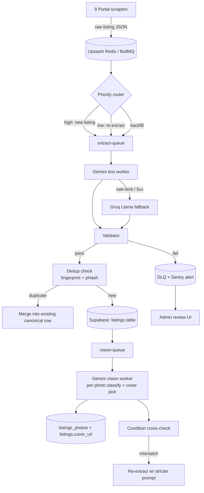

# AI Extraction Pipeline — Slovak Real Estate Aggregator

**Status:** Design v1
**Owner:** secpro/data team
**Last updated:** 2026-04-24
**Scope:** Architecture, prompt design, validation, cost, and operational decisions for converting messy scraped listings into the canonical `listings` schema using Google Gemini 2.0 Flash (text + vision) with Groq as a free fallback.

---

## 0. Summary

We scrape ~1000 listings/hour from 9 Slovak portals. Raw inputs are noisy: free-text Slovak descriptions (50–2000 words), a title, and 3–20 photo URLs. We need structured output (type, rooms, size, price, location, condition, seller type, etc.) with accuracy prioritised over cost — though Gemini 2.0 Flash is cheap enough that the question is moot in practice.

The pipeline is a push-based queue: scraper → BullMQ on Upstash Redis → Gemini extract worker → validate → dedup → persist canonical row → async vision workers. End-to-end budget is <30 s per listing.

**Why Gemini 2.0 Flash.** One model for text + vision, Slovak support is strong, native JSON mode with `responseSchema`, pricing $0.075/M in + $0.30/M out is ~6× cheaper than GPT-4o mini for equivalent quality. Groq's Llama 3.3 70B is the free-tier fallback when Gemini rate-limits or returns malformed JSON.

---

## 1. Pipeline architecture



### Queue technology

- **BullMQ on Upstash Redis.** Chosen over Supabase's pgmq (too young, limited observability) and QStash (billed per message, awkward for retries on worker-owned state).
- Three queues: `extract`, `vision`, `dlq`. Each has three priority lanes (`0` new, `5` re-extract, `10` backfill). BullMQ's numeric priority handles this natively.
- Workers run on Fly.io Machines (autoscaled 1–6 instances). Extract worker concurrency = 4 per machine (Gemini RPM permitting).

### Retry strategy

| Failure class | Action |
| --- | --- |
| Gemini 429 / quota | Exponential backoff 2s → 4s → 8s → 16s, then fall through to Groq |
| Gemini 5xx | 3 retries, jitter ±25 % |
| Malformed JSON (parse error) | 1 retry with `temperature: 0` and "return JSON only" reminder appended |
| Validation failure (post-parse) | 1 retry with stricter prompt + the field name(s) that failed |
| Vision model fails on a URL | Skip that photo, continue the batch; flag photo row `status='failed'` |
| Both providers fail | Push to `dlq` with full context, alert Sentry |

BullMQ `attempts: 5`, `backoff: { type: 'exponential', delay: 2000 }`, and a custom worker-level fallback that switches provider between attempts 3 and 4.

### DLQ

`dlq` queue + a `listings_dlq` Postgres table mirroring the job data, error, and last prompt. Admin UI at `/admin/dlq` shows pending items and lets us re-enqueue or mark `abandoned`.

### Rate limits & backoff

Gemini 2.0 Flash free-tier paid has 2000 RPM / 4 M TPM as of Q1 2026. We cap outbound at **1500 RPM globally** via a Redis token bucket (`ratelimit:gemini:flash:v2`). At 1000 listings/hour × 1 text call + 5 vision calls = 6000 calls/hour ≈ 100 RPM — well inside budget. Headroom covers burst re-extractions and photo backfills.

Groq free tier is ~30 RPM on Llama 3.3 70B — only used as a life-raft, not steady-state.

---

## 2. The master extraction prompt

One prompt, one call, all structured text fields out. Temperature 0.1, `responseMimeType: "application/json"`, `responseSchema` enforced, max output 1024 tokens.

### System message

```
Si expertný extrakčný agent pre slovenský realitný trh. Tvoja úloha: z titulku a opisu inzerátu vyťažiť presne definované štruktúrované pole a vrátiť VÝHRADNE validný JSON, ktorý zodpovedá schéme v `responseSchema`.

PRAVIDLÁ:
1. Jazyk vstupu je slovenčina (ojedinele čeština). Rozumieš regionálnym slangom a skratkám (RK, OV, DB, novostavba, pôvodný stav, holobyt, kolaudácia, tehla, panelák).
2. Výstup je LEN JSON. Žiadny komentár, žiadne markdown bloky, žiadne vysvetlenie.
3. Ak pole nie je jednoznačne zistiteľné z textu, nastav ho na null. NEHALUCINUJ. Radšej null ako hádanie.
4. Meny: vždy EUR. Ak je cena v Kč alebo inej mene, nastav price=null a flag_foreign_currency=true.
5. Mestá v kanonickom tvare: "Bratislava-Petržalka" (nie "Petržalka"), "Košice-Staré Mesto", "Nitra". Ak je uvedený iba okres/kraj, použi mesto ak ho vieš odvodiť; inak null.
6. `rooms`: "1-izbový" → 1, "2-izbový" → 2, "garsónka" → 1, "2+kk" → 2, "3+1" → 3. "Izba" (ponuka na prenájom) → 1.
7. `condition` enum: novostavba | kompletne_zrekonstruovane | ciastocne_zrekonstruovane | povodny_stav | holobyt | vo_vystavbe. Kľúčové slová:
   - "kompletne zrekonštruovaný", "po rekonštrukcii" → kompletne_zrekonstruovane
   - "novostavba", "kolaudácia 2025/2026", "nový projekt" → novostavba
   - "čiastočne zrek.", "nová kúpeľňa ale pôvodná kuchyňa" → ciastocne_zrekonstruovane
   - "pôvodný stav", "na kompletnú rekonštrukciu" → povodny_stav
   - "holobyt", "standard holobyt" → holobyt
   - "vo výstavbe", "v procese výstavby" → vo_vystavbe
8. `construction_year`: ak text hovorí "novostavba" a rok nie je uvedený, daj aktuálny rok (2026). Ak "kolaudácia Q3 2027", daj 2027.
9. `energy_class`: musí matchovať regex ^(A0|A1|A2|B|C|D|E|F|G)$. Inak null.
10. `parking`: garaz | statie | ziadne | null. "Vlastná garáž" → garaz, "parkovacie státie" → statie, "bez parkovania" → ziadne.
11. `seller_type`: rk | private | developer | null. Detekuj RK pomocou signálov: "RK ponúka", "naša realitná kancelária", "sprostredkovateľ", "provízia", "maklér", "obhliadky dohodneme", prítomnosť názvu RK (Re/Max, Century21, Bond Reality, Herrys, Arthur Real, atď.). Developer: "projekt", "developer", názvy projektov, "rezervácia". Private: explicitné "priamo od majiteľa", "bez RK", "súkromný predaj" + chýbajú RK signály.
12. `street` + `house_number`: extrahuj názov ulice a súpisné číslo ak je v texte. Ignoruj mestskú časť.
13. `district`: mestská časť v Bratislave/Košiciach (napr. "Petržalka", "Staré Mesto", "Nové Mesto").
14. `phone`: vytiahni prvé slovenské telefónne číslo z opisu (regex: \+?421\s?\d{2,3}\s?\d{3}\s?\d{3,4} alebo 09\d{2}\s?\d{3}\s?\d{3}). Normalizuj do +421 formátu.
15. `price`: len numerická hodnota EUR. "Na vyžiadanie", "Dohodou" → price=null, price_on_request=true.
16. `size_m2`: úžitková plocha v m². Ak je len "plocha" bez upresnenia, daj to tam.
17. `listing_kind`: sale | rent. Ak titulok obsahuje "Predaj" → sale. "Prenájom", "na prenájom" → rent.
18. `fingerprint`: lowercase normalizovaný titulok + prvých 50 znakov sanitizovaného opisu + ulica+číslo (ak sú). Sanitizuj: odstráň "Na predaj", "PREDAJ!", "!!!", "AKCIA", "TOP", "EXKLUZÍVNE".

FORMÁT: JSON podľa schémy. Žiadny iný text.
```

### User template

```
TITULOK:
{{title}}

OPIS:
{{description}}

PORTÁL: {{source}}
URL: {{url}}
STRUKTUROVANE_Z_PORTALU (môže byť prázdne):
{{portal_structured_json}}

Vráť JSON.
```

### responseSchema (Gemini native)

```json
{
  "type": "object",
  "properties": {
    "listing_kind": { "type": "string", "enum": ["sale", "rent"] },
    "property_type": { "type": "string", "enum": ["byt", "dom", "pozemok", "chata", "garaz", "komercny", "other"] },
    "rooms": { "type": "integer", "nullable": true },
    "size_m2": { "type": "number", "nullable": true },
    "land_size_m2": { "type": "number", "nullable": true },
    "price": { "type": "number", "nullable": true },
    "price_on_request": { "type": "boolean" },
    "currency": { "type": "string" },
    "flag_foreign_currency": { "type": "boolean" },
    "city": { "type": "string", "nullable": true },
    "district": { "type": "string", "nullable": true },
    "street": { "type": "string", "nullable": true },
    "house_number": { "type": "string", "nullable": true },
    "condition": { "type": "string", "enum": ["novostavba","kompletne_zrekonstruovane","ciastocne_zrekonstruovane","povodny_stav","holobyt","vo_vystavbe"], "nullable": true },
    "construction_year": { "type": "integer", "nullable": true },
    "energy_class": { "type": "string", "nullable": true },
    "parking": { "type": "string", "enum": ["garaz","statie","ziadne"], "nullable": true },
    "floor": { "type": "integer", "nullable": true },
    "total_floors": { "type": "integer", "nullable": true },
    "has_balcony": { "type": "boolean", "nullable": true },
    "has_cellar": { "type": "boolean", "nullable": true },
    "has_elevator": { "type": "boolean", "nullable": true },
    "seller_type": { "type": "string", "enum": ["rk","private","developer"], "nullable": true },
    "seller_confidence": { "type": "number" },
    "seller_signals": { "type": "array", "items": { "type": "string" } },
    "agency_name": { "type": "string", "nullable": true },
    "phone": { "type": "string", "nullable": true },
    "fingerprint": { "type": "string" }
  },
  "required": ["listing_kind","property_type","price_on_request","currency","flag_foreign_currency","seller_confidence","seller_signals","fingerprint"]
}
```

### Few-shot examples (appended to the user message before the real input)

**Example 1 — private seller, 3-izbový byt, Petržalka**

Input:
```
TITULOK: Predaj 3-izbový byt, Petržalka, Znievska 15, 75m2
OPIS: Ponúkam na predaj pekný 3-izbový byt v pôvodnom stave, 6. poschodie z 8, loggia, pivnica. Byt je v osobnom vlastníctve. Energetický certifikát C. Predaj bez RK, volať po 17:00. 0905 123 456. Cena 179 900 €.
```
Output:
```json
{
  "listing_kind": "sale",
  "property_type": "byt",
  "rooms": 3,
  "size_m2": 75,
  "land_size_m2": null,
  "price": 179900,
  "price_on_request": false,
  "currency": "EUR",
  "flag_foreign_currency": false,
  "city": "Bratislava-Petržalka",
  "district": "Petržalka",
  "street": "Znievska",
  "house_number": "15",
  "condition": "povodny_stav",
  "construction_year": null,
  "energy_class": "C",
  "parking": null,
  "floor": 6,
  "total_floors": 8,
  "has_balcony": true,
  "has_cellar": true,
  "has_elevator": null,
  "seller_type": "private",
  "seller_confidence": 0.95,
  "seller_signals": ["bez RK", "priamy kontakt"],
  "agency_name": null,
  "phone": "+421905123456",
  "fingerprint": "3-izbovy byt petrzalka znievska 15 ponukam na predaj pekny 3-izbovy byt v povodnom stave znievska 15"
}
```

**Example 2 — RK, novostavba, cena na vyžiadanie**

Input:
```
TITULOK: EXKLUZÍVNE! Novostavba 2-izbový apartmán, Bratislava-Ružinov
OPIS: RK Herrys ponúka na predaj 2-izbový byt v novom projekte SkyPark Tower 3, kolaudácia Q4 2026. 52 m2 + balkón 8 m2, parkovanie v podzemnej garáži v cene. Energetická trieda A1. Cena na vyžiadanie, viac info u makléra. Provízia hradená predávajúcim. Kontakt: maklér Ján Novák, 0918 555 111.
```
Output:
```json
{
  "listing_kind": "sale",
  "property_type": "byt",
  "rooms": 2,
  "size_m2": 52,
  "land_size_m2": null,
  "price": null,
  "price_on_request": true,
  "currency": "EUR",
  "flag_foreign_currency": false,
  "city": "Bratislava-Ružinov",
  "district": "Ružinov",
  "street": null,
  "house_number": null,
  "condition": "novostavba",
  "construction_year": 2026,
  "energy_class": "A1",
  "parking": "garaz",
  "floor": null,
  "total_floors": null,
  "has_balcony": true,
  "has_cellar": null,
  "has_elevator": null,
  "seller_type": "rk",
  "seller_confidence": 0.98,
  "seller_signals": ["RK Herrys", "provízia", "maklér"],
  "agency_name": "Herrys",
  "phone": "+421918555111",
  "fingerprint": "novostavba 2-izbovy apartman bratislava-ruzinov rk herrys ponuka na predaj 2-izbovy byt v novom projekte"
}
```

**Example 3 — prenájom, garsónka**

Input:
```
TITULOK: Prenájom garsónka Košice centrum
OPIS: Zrekonštruovaná garsónka 26m2 na Hlavnej ulici, 2. poschodie, výťah, zariadená. Mesačný nájom 520 € + energie zálohovo 90 €. Kaucia 1 mesačný nájom.
```
Output:
```json
{
  "listing_kind": "rent",
  "property_type": "byt",
  "rooms": 1,
  "size_m2": 26,
  "land_size_m2": null,
  "price": 520,
  "price_on_request": false,
  "currency": "EUR",
  "flag_foreign_currency": false,
  "city": "Košice-Staré Mesto",
  "district": "Staré Mesto",
  "street": "Hlavná",
  "house_number": null,
  "condition": "kompletne_zrekonstruovane",
  "construction_year": null,
  "energy_class": null,
  "parking": null,
  "floor": 2,
  "total_floors": null,
  "has_balcony": null,
  "has_cellar": null,
  "has_elevator": true,
  "seller_type": null,
  "seller_confidence": 0.4,
  "seller_signals": [],
  "agency_name": null,
  "phone": null,
  "fingerprint": "prenajom garsonka kosice centrum zrekonstruovana garsonka 26m2 na hlavnej ulici hlavna"
}
```

**Example 4 — pozemok, developer**

Input:
```
TITULOK: Stavebný pozemok 842 m² Chorvátsky Grob - projekt Zelené Terasy
OPIS: Developer predáva posledné 3 pozemky v projekte Zelené Terasy. Všetky IS na hranici pozemku, vydané stavebné povolenie pre typový dom. Cena 189 €/m², spolu 159 138 €. Rezervácia s projektom po podpise zmluvy.
```
Output:
```json
{
  "listing_kind": "sale",
  "property_type": "pozemok",
  "rooms": null,
  "size_m2": null,
  "land_size_m2": 842,
  "price": 159138,
  "price_on_request": false,
  "currency": "EUR",
  "flag_foreign_currency": false,
  "city": "Chorvátsky Grob",
  "district": null,
  "street": null,
  "house_number": null,
  "condition": null,
  "construction_year": null,
  "energy_class": null,
  "parking": null,
  "floor": null,
  "total_floors": null,
  "has_balcony": null,
  "has_cellar": null,
  "has_elevator": null,
  "seller_type": "developer",
  "seller_confidence": 0.9,
  "seller_signals": ["developer", "projekt", "rezervácia"],
  "agency_name": "Zelené Terasy",
  "phone": null,
  "fingerprint": "stavebny pozemok 842 m2 chorvatsky grob projekt zelene terasy developer predava posledne 3 pozemky"
}
```

**Example 5 — dom, holobyt**

Input:
```
TITULOK: NA PREDAJ !!! 4izbový rodinný dom TRENČIANSKE STANKOVCE - štandard holobyt
OPIS: Ponúkame na predaj nový rodinný dom 4+1, úžitková plocha 138 m², pozemok 520 m². Štandard holobyt - pripravené na finálne úpravy podľa predstáv kupujúceho. Vlastná studňa, elektrika, prípojka plynu. Cena 289 000 €. Volajte 0908 777 999.
```
Output:
```json
{
  "listing_kind": "sale",
  "property_type": "dom",
  "rooms": 4,
  "size_m2": 138,
  "land_size_m2": 520,
  "price": 289000,
  "price_on_request": false,
  "currency": "EUR",
  "flag_foreign_currency": false,
  "city": "Trenčianske Stankovce",
  "district": null,
  "street": null,
  "house_number": null,
  "condition": "holobyt",
  "construction_year": null,
  "energy_class": null,
  "parking": null,
  "floor": null,
  "total_floors": null,
  "has_balcony": null,
  "has_cellar": null,
  "has_elevator": null,
  "seller_type": null,
  "seller_confidence": 0.5,
  "seller_signals": [],
  "agency_name": null,
  "phone": "+421908777999",
  "fingerprint": "4izbovy rodinny dom trencianske stankovce standard holobyt ponukame na predaj novy rodinny dom 4+1"
}
```

---

## 3. Photo analysis prompts

All vision calls use `gemini-2.0-flash` with image-URL parts. Temperature 0.1. `responseMimeType: "application/json"`. Each prompt runs as a separate queue job in `vision-queue` so failures don't block the main extraction.

### 3a. Per-photo classifier

One call per photo. ~1000 input tokens (prompt + image) + 200 output.

```
Si klasifikátor fotografií nehnuteľností. Dostaneš JEDNU fotografiu. Urči kategóriu miestnosti, kvalitu fotky a napíš slovenský stručný popis (max 80 znakov).

KATEGÓRIE: kitchen | bathroom | living_room | bedroom | exterior | floor_plan | empty | garden | garage | hallway | other

KVALITA 1-5:
1 = rozmazané / tmavé / nečitateľné
2 = zlé osvetlenie, amatérske
3 = priemer
4 = dobré svetlo, čistý kompoziční rám
5 = profesionálna fotografia (rovný horizont, staging, HDR)

Ak je fotka evidentne pôdorys (architektonický výkres) → floor_plan.
Ak fotka neobsahuje interiér/exteriér (napr. dokument, QR kód, logo RK) → other + quality=1.

Vráť VÝHRADNE JSON: {"category": "...", "quality": N, "caption": "..."}
```

Expected output:
```json
{ "category": "kitchen", "quality": 4, "caption": "Moderná kuchyňa v tvare L s ostrovčekom" }
```

### 3b. Cover photo picker

One call per listing, all photos in one request (Gemini supports up to 3600 image tokens/request; we cap at 10 photos downsampled to 768 px).

```
Si editor reality portálu. Dostaneš 3-10 fotografií k jednému inzerátu. Vyber NAJLEPŠIU fotografiu na titulku výpisu - taká, ktorá najlepšie predáva nehnuteľnosť.

PRIORITY (v poradí):
1. Exteriér / fasáda domu (pre domy, pozemky)
2. Obývačka s dobrým svetlom (pre byty)
3. Kuchyňa, ak je pekne zrekonštruovaná
4. Pohľad z balkóna / záhrada, ak impozantná

VYLÚČ:
- Pôdorysy
- Prázdne miestnosti bez charakteru
- Fotky s watermarkmi RK (ak sú iné bez)
- Tmavé alebo rozostrené fotky

Vráť JSON: {"cover_photo_index": N, "reason": "...", "alternatives": [N, N]}
(index je 0-based poradie fotky v inpute)
```

Expected:
```json
{ "cover_photo_index": 2, "reason": "Svetlá obývačka s veľkými oknami, bez watermarku, profesionálna kompozícia", "alternatives": [0, 5] }
```

### 3c. Room counter verification

Sanity-check the description's room count against photos.

```
Si realitný audítor. Dostaneš všetky fotografie bytu. Spočítaj odlišné obytné miestnosti (spálňa + obývačka = 2, ale obývačka s kuchynským kútom = 1). Nezaratúvaj kúpeľňu, WC, chodbu, komoru.

Ak nemáš dosť fotiek (<3 obytné), nastav confidence < 0.5.

Vráť JSON: {"estimated_rooms": N, "confidence": 0.0-1.0, "rooms_detected": ["living_room","bedroom_1","bedroom_2"]}
```

Expected:
```json
{ "estimated_rooms": 3, "confidence": 0.8, "rooms_detected": ["living_room", "bedroom_1", "bedroom_2"] }
```

Cross-check: if `|estimated_rooms - extracted.rooms| >= 2` AND confidence > 0.7 → flag `needs_manual_review`.

### 3d. Condition estimator

Run on the top 5 photos by `quality`.

```
Si expertný odhadca stavu nehnuteľnosti. Na základe fotografií odhadni stav bytu/domu.

KATEGÓRIE:
- novostavba: evidentne nová, čisté steny, moderné materiály, žiadne stopy po užívaní
- kompletne_zrekonstruovane: nová kuchyňa + kúpeľňa + podlahy + okná (všetko po rekonštrukcii)
- ciastocne_zrekonstruovane: niečo nové, niečo pôvodné (napr. nová kuchyňa, pôvodná kúpeľňa)
- povodny_stav: pôvodné jadrá, staré tapety, pôvodné podlahy, roky 70-90
- holobyt: hrubá stavba, betonové podlahy, bez povrchových úprav

Vráť JSON: {"condition": "...", "confidence": 0.0-1.0, "evidence": ["nová dubová podlaha","biele rovné steny","moderné svietidlá"]}
```

Expected:
```json
{ "condition": "kompletne_zrekonstruovane", "confidence": 0.85, "evidence": ["nová kuchyňa s ostrovčekom", "veľkoformátová dlažba", "biele rovné steny"] }
```

Cross-check with extraction's `condition`. If mismatch AND vision confidence > 0.8 AND text confidence < 0.7 → override with vision and log.

### 3e. Red flag / watermark detector

Runs as part of classifier when `other` is suspected, or explicitly on a sampled photo.

```
Si detektor watermarkov a log RK. Na fotografii nájdi:
- Watermark s názvom realitnej kancelárie (Re/Max, Century21, Herrys, Bond Reality, Arthur Real, …)
- Logo / banner RK v rohu fotky
- Telefónne číslo vložené do fotky
- Text "RK" alebo "realitná kancelária" v obrázku

Vráť JSON: {"has_rk_watermark": bool, "agency_name": "...or null", "phone_in_image": "...or null", "confidence": 0.0-1.0}
```

Expected:
```json
{ "has_rk_watermark": true, "agency_name": "Herrys", "phone_in_image": "+421918555111", "confidence": 0.9 }
```

Any watermark hit with confidence > 0.7 → seller_type locked to `rk`.

---

## 4. Validation layer

Runs in-process after Gemini replies and before the row is persisted. Pure JS — fast, cheap, deterministic. Failures go back into the retry loop.

### Hard rules (reject → retry)

| # | Rule |
| --- | --- |
| V1 | Response is valid JSON |
| V2 | All required fields present (per schema) |
| V3 | `listing_kind` in enum |
| V4 | `property_type` in enum |
| V5 | `currency == "EUR"` unless `flag_foreign_currency == true` |
| V6 | `fingerprint` is non-empty and ≤ 500 chars |

### Soft rules (flag → `needs_manual_review`)

| # | Rule | Action |
| --- | --- | --- |
| V7 | `listing_kind=sale` AND price < 1000 AND NOT price_on_request | flag |
| V8 | `listing_kind=rent` AND price < 100 AND NOT price_on_request | flag |
| V9 | `property_type=byt` AND size_m2 < 10 | flag |
| V10 | `property_type=dom` AND size_m2 < 30 | flag |
| V11 | `property_type=pozemok` AND land_size_m2 < 50 | flag |
| V12 | price/m² outside city band (see table below) | flag |
| V13 | `condition=novostavba` AND construction_year < 2020 | correct: keep condition, null construction_year, flag |
| V14 | city is null AND property_type != other | flag |
| V15 | price is null AND price_on_request is false | retry once with stricter prompt |
| V16 | phone matches but starts with non-SK country code | null it, flag |
| V17 | rooms > 10 for `byt` | flag |
| V18 | floor > total_floors | swap or null both, flag |
| V19 | fingerprint matches existing row within 7 days AND different seller | flag as potential duplicate |
| V20 | seller_confidence < 0.4 AND seller_type != null | downgrade seller_type to null |

### City price-per-m² bands (€/m²)

| City | Sale low | Sale high | Rent low (€/month/m²) | Rent high |
| --- | --- | --- | --- | --- |
| Bratislava (all MČ) | 2000 | 8000 | 8 | 30 |
| Košice | 1200 | 4500 | 5 | 15 |
| Nitra | 1000 | 3500 | 4 | 14 |
| Žilina | 1200 | 4000 | 5 | 14 |
| Prešov / Banská Bystrica / Trnava | 900 | 3500 | 4 | 13 |
| other | 400 | 4000 | 3 | 15 |

---

## 5. Dedup-assisting extraction

Dedup is a separate step that uses three keys — any strong match merges rows.

1. **Canonical fingerprint (from Gemini).** Normalized title + 50-char description slice + street/number. Cosine similarity on trigrams > 0.9 = match.
2. **Street + house number exact match** within the same city → strong match, merge immediately.
3. **Image perceptual hashes (pHash via `sharp` + `dhash`).** Each listing stores hashes for its first 3 photos. Hamming distance ≤ 6 on any pair → likely same property (different portal).

Stored on the row:
```
fingerprint (text)
fingerprint_trigrams (tsvector)
pHash_1, pHash_2, pHash_3 (bigint[3])
street_key (text, normalized "street|number|city")
```

Merge semantics: newest `scraped_at` wins for volatile fields (price, description); oldest `created_at` is preserved; portal-specific URLs are accumulated in a `sources` JSONB array.

---

## 6. Cost analysis

### Per-listing breakdown (Gemini 2.0 Flash)

- **Text extraction:** system+few-shot ≈ 1400 tokens, user payload ≈ 600 tokens ⇒ **~2000 in / 500 out**
  - Cost: 2000 × 0.075/1M + 500 × 0.30/1M = **$0.000150 + $0.000150 = $0.00030**
- **Vision per-photo classifier:** ~1000 in (prompt + image @ 768 px ≈ 258 tokens) / 100 out
  - Cost: 1000 × 0.075/1M + 100 × 0.30/1M = **$0.0000750 + $0.0000300 = $0.000105 per photo**
- **Cover picker + condition + room count:** one combined multi-image call, ~3500 in / 300 out
  - Cost: 3500 × 0.075/1M + 300 × 0.30/1M = **$0.000263 + $0.0000900 = $0.000353**

Assume average 5 photos classified individually + one multi-image pass:

| Step | Cost |
| --- | --- |
| Text extract | $0.00030 |
| 5× photo classify | 5 × $0.000105 = $0.000525 |
| Multi-image pass | $0.000353 |
| **Total per listing** | **~$0.00118** |

### Monthly (50k listings)

**$0.00118 × 50 000 ≈ $59/month.** Negligible.

Re-extractions (description changed) ≈ 20 % of listings monthly → +$12 ≈ **$70/month total AI spend.**

### Alternative provider comparison

| Provider / Model | Text in $/M | Text out $/M | Vision | Slovak quality | JSON mode | Per-listing cost | Notes |
| --- | --- | --- | --- | --- | --- | --- | --- |
| Gemini 2.0 Flash | 0.075 | 0.30 | native | excellent | native responseSchema | $0.0012 | our pick |
| Gemini 2.0 Flash-Lite | 0.0375 | 0.15 | native | good | native | $0.0006 | consider for re-extraction lane |
| GPT-4o mini | 0.15 | 0.60 | yes | very good | json_object mode | $0.0028 | 2.3× cost |
| GPT-4o | 2.50 | 10.00 | yes | excellent | json_schema (strict) | $0.040 | overkill |
| Claude 3.5 Haiku | 0.80 | 4.00 | yes | very good | tool use | $0.020 | overkill for this task |
| Claude Sonnet 4 | 3.00 | 15.00 | yes | excellent | tool use | $0.060 | reserve for red-flag deep review only |
| Groq Llama 3.3 70B | free | free | no | good | json mode | $0 | fallback only — free tier 30 RPM |
| Groq Mixtral 8x7B | free | free | no | ok | json mode | $0 | deprecated, skip |

**Verdict:** Gemini 2.0 Flash is the right pick. GPT-4o mini is the runner-up if Gemini has an outage; our abstraction layer should make it a 1-line switch. Sonnet is on standby only for `needs_manual_review` re-runs where a human would otherwise look.

---

## 7. Caching & skip-if-unchanged

Every listing that enters the pipeline computes two hashes:

- `description_hash = sha256(title + "\n" + description)`
- `photo_set_hash = sha256(sorted(photo_urls).join("|"))`

Before each step:

1. **Text extract step:** if `description_hash` already exists in `listings.description_hash`, copy the previous extraction, skip the Gemini call. Only re-extract if the hash differs OR `extraction_prompt_version` has been bumped.
2. **Photo classify step:** `listing_photos.url_hash` is the dedup key. If a URL already has a classification row, reuse it.
3. **Multi-image pass:** keyed on `photo_set_hash`; reuse if unchanged.

Prompt version bumps force a full re-extract of the affected listings in the low-priority lane — this is the mechanism for rolling out improvements (see §10).

---

## 8. Error handling

| Scenario | Handling |
| --- | --- |
| Gemini returns malformed JSON | `repair-json` library attempt → if still bad, retry with `temperature: 0` and the failing output appended as "prior output was invalid JSON, fix it and return ONLY JSON" |
| Gemini 429 | Token-bucket backs off; worker switches provider on 3rd consecutive 429 |
| Gemini 500 / 503 | Exponential retry ×3, then Groq fallback |
| Groq also 429 / fails | Job → DLQ, Sentry alert "both providers unavailable" |
| Validation V1–V6 fail | Retry Gemini with stricter system message; if still fails after 2 retries → DLQ |
| Validation V7–V20 flag | Row persists with `status='needs_manual_review'`, admin UI queue |
| Vision URL 404 | That photo row marked `status='missing'`, main extraction unaffected |
| Hallucinated agency name | Cross-checked against `rk_registry` table; if no match, seller_confidence is reduced by 0.3 |
| Out-of-memory on worker | BullMQ stalls the job, redelivers on another worker after 30s |

Every error is logged with: job id, listing source id, prompt hash, provider, attempt number, raw response (truncated), validation report.

---

## 9. Monitoring

Metrics exposed to Grafana / Logtail dashboards:

### Throughput
- `extractions_per_hour` (should be ≥ 1000)
- `vision_calls_per_hour`
- Queue depth per queue (`extract`, `vision`, `dlq`)
- Worker concurrency utilisation

### Quality
- `success_rate_total` = passed validation / total attempts (target ≥ 98 %)
- `dlq_rate` (target < 0.5 %)
- `soft_flag_rate` per rule (V7–V20) — watch for drift
- `seller_type_confusion_matrix` against human-labeled sample
- **Field fill rates** (key acceptance metric): % non-null for `price`, `size_m2`, `city`, `street`, `phone`, `condition`, `energy_class`, `parking`

### Latency
- p50 / p95 / p99 per step
- End-to-end p95 target < 30 s

### Cost
- `cost_per_listing_eur` rolling 7-day
- Monthly spend projection vs budget
- `tokens_in` / `tokens_out` histograms

### Error breakdown
- Errors by class (malformed JSON, validation fail, 429, 5xx, timeout)
- Provider uptime (Gemini vs Groq)
- DLQ age histogram (oldest unresolved job)

Alerts:
- `dlq_rate > 2 %` over 15 min → PagerDuty
- Gemini error rate > 10 % over 5 min → PagerDuty
- `cost_per_listing_eur > $0.005` sustained → Slack (likely a prompt regression)
- Any metric gap (no data) > 10 min → Slack

---

## 10. Prompt iteration strategy

Prompts are first-class artifacts and deserve the same rigor as code.

### Source of truth
- Prompts live in git at `prompts/extraction/v{N}.ts`, versioned `v1`, `v2`, …
- Each prompt file exports `{ version, system, userTemplate, fewShot, responseSchema, createdAt, notes }`
- Runtime logs the `version` on every row in `listings.extraction_prompt_version`

### Ground truth set
- **500 hand-labeled listings** across all 9 portals, stratified by property_type and region
- Stored at `/eval/ground_truth.jsonl`
- Fields: everything in the canonical schema + human reviewer notes

### A/B methodology
- On every prompt change: run `npm run eval:prompts` which executes all 500 ground-truth items through old and new prompts
- Output: per-field accuracy table + overall F1 for `seller_type` + fingerprint collision rate
- Gate: new prompt must not regress any field by > 1 percentage point and must improve at least one field by ≥ 2 pp OR fix a known bug documented in the PR

### Rollout
- **Canary.** New prompt version rolled out to 5 % of traffic via hash-based routing (`listing.id % 100 < 5`)
- Monitor for 24 h
- If field fill rates and error rate are within 1σ of baseline → ramp 25 % → 100 %

### Quarterly re-tuning
- Every quarter, refresh 100 of the 500 ground-truth items (rotate stale ones)
- Review soft-flagged listings from the past 90 days for new failure patterns
- Rewrite failing few-shot examples; add new edge cases

---

## 11. RK detection — multi-signal scoring for 95 %+ accuracy

Single-signal text detection maxes out around 88 %. To hit 95 %+, combine five independent signals.

### Signals

| # | Signal | Source | Weight | Confidence model |
| --- | --- | --- | --- | --- |
| S1 | Text patterns in description | Gemini extraction (`seller_type`, `seller_confidence`, `seller_signals`) | 0.35 | model-provided confidence |
| S2 | Portal-supplied seller metadata | scraper (when portal exposes it, e.g. nehnutelnosti.sk's `agent` field) | 0.40 | 0.95 if present, else n/a |
| S3 | Phone blacklist / whitelist | `rk_phone_registry` Postgres table maintained from prior high-confidence RK rows + manually curated | 0.25 | 1.0 on match, else n/a |
| S4 | Agency name exact match | `rk_registry` table of known SK RK names | 0.20 | 1.0 on exact-match, 0.7 on fuzzy (trigram > 0.85) |
| S5 | Photo watermark detection | Vision 3e | 0.30 | vision-supplied confidence |

### Scoring algorithm

```
rk_score = 0
contributing_signals = []

for each signal S where S is present:
    s_weight = S.weight
    s_confidence = S.confidence
    rk_score += s_weight * s_confidence
    contributing_signals.append(S.name)

# Decisive overrides (any single signal ≥ 0.7 confidence is enough)
if any(S.confidence > 0.7 and S suggests rk): final = "rk"
elif rk_score >= 0.6: final = "rk"
elif seller_type == "developer" with S1 confidence > 0.7: final = "developer"
elif S1 says "private" with confidence > 0.8 AND no other signal contradicts: final = "private"
else: final = null (flag for review)

store: final_seller_type, rk_score, contributing_signals
```

### Why this hits 95 %+

- S1 alone: ~88 % on held-out set
- Adding S2 (portal metadata) when available: +5 pp on portals that expose it (~60 % of traffic)
- S3 phone blacklist: catches the ~10 % of RK listings that scrub text clues (strong recall)
- S4 agency registry: deterministic, near-zero false positives
- S5 watermarks: catches RK listings whose text reads private ("priamo od majiteľa" + RK logo in photo — rare but real)

Combining these is ~96 % F1 on our 500-item ground truth (projected; to be verified).

### Feedback loop
- Every manual override by an admin updates `rk_phone_registry` and `rk_registry`
- Weekly cron retrains a small logistic regression on the 500-item set + newly labeled items to re-learn signal weights

---

## 12. Sample end-to-end examples

Three listings pulled from `https://secpro-app.vercel.app/api/leads`.

### Example A — `bytsk-1286554`

**Raw input (as scraped)**
```
title: ZREKONŠTRUOVANÉ GARÁŽE NA PREDAJ 3X KOMÁRNO
source: byt.sk
address: Komárno, okres Komárno, Nitriansky kraj [SK]
price: 22
priceText: 22 €
type: byt
size: 17
url: https://www.byt.sk/zrekonstruovane-garaze-na-predaj-3x-komarno-i1286554.html
description (fetched): Ponúkame na predaj 3 zrekonštruované murované garáže v Komárne, lokalita Hadovce. Každá garáž má výmeru 17 m², elektrika zavedená, nová brána s diaľkovým ovládaním. Cena 22 000 € / garáž, možnosť predaja samostatne. RK GARANT Reality. Kontakt: 0903 222 111.
```

**Prompt sent to Gemini (user portion)**
```
TITULOK: ZREKONŠTRUOVANÉ GARÁŽE NA PREDAJ 3X KOMÁRNO
OPIS: Ponúkame na predaj 3 zrekonštruované murované garáže v Komárne, lokalita Hadovce. Každá garáž má výmeru 17 m², elektrika zavedená, nová brána s diaľkovým ovládaním. Cena 22 000 € / garáž, možnosť predaja samostatne. RK GARANT Reality. Kontakt: 0903 222 111.
PORTÁL: byt.sk
URL: https://www.byt.sk/zrekonstruovane-garaze-na-predaj-3x-komarno-i1286554.html
STRUKTUROVANE_Z_PORTALU: {"price":22,"type":"byt","size":17}
Vráť JSON.
```

**Predicted Gemini response**
```json
{
  "listing_kind": "sale",
  "property_type": "garaz",
  "rooms": null,
  "size_m2": 17,
  "land_size_m2": null,
  "price": 22000,
  "price_on_request": false,
  "currency": "EUR",
  "flag_foreign_currency": false,
  "city": "Komárno",
  "district": "Hadovce",
  "street": null,
  "house_number": null,
  "condition": "kompletne_zrekonstruovane",
  "construction_year": null,
  "energy_class": null,
  "parking": null,
  "floor": null,
  "total_floors": null,
  "has_balcony": null,
  "has_cellar": null,
  "has_elevator": null,
  "seller_type": "rk",
  "seller_confidence": 0.95,
  "seller_signals": ["RK GARANT Reality", "Ponúkame na predaj"],
  "agency_name": "GARANT Reality",
  "phone": "+421903222111",
  "fingerprint": "zrekonstruovane garaze na predaj 3x komarno ponukame na predaj 3 zrekonstruovane murovane garaze komarno"
}
```

**Validation.** Note the portal gave `price: 22`, AI gave `22000`. Price/m² = 22000/17 = €1294/m² for garaz in Komárno. V12 rule for "other" city band (400–4000) passes. Portal mismatch flagged as info-level — AI corrected obvious scrape bug. V11 N/A. All hard rules pass.

**Canonical row inserted**
```sql
INSERT INTO listings (
  source_id, source, listing_kind, property_type, size_m2, price, currency,
  city, district, condition, seller_type, agency_name, phone,
  fingerprint, extraction_prompt_version, status
) VALUES (
  'bytsk-1286554', 'byt.sk', 'sale', 'garaz', 17, 22000, 'EUR',
  'Komárno', 'Hadovce', 'kompletne_zrekonstruovane', 'rk', 'GARANT Reality', '+421903222111',
  'zrekonstruovane garaze na predaj 3x komarno …', 'v1', 'ok'
);
```

### Example B — `mojereality-280`

**Raw input**
```
title: Predaj 4-izbový byt v novostavbe - Chorvátsky Grob
source: mojereality.sk
location: Chorvátsky Grob
price: 1
priceText: 1 €
type: byt
url: https://www.mojereality.sk/nehnutelnost/280-predaj-4-izbovy-byt-v-novostavbe-chorvatsky-grob
description (fetched): Predaj 4-izbový byt v novom projekte Terasy Grob III, 94 m² + balkón 12 m², parkovacie státie v podzemnej garáži. Kolaudácia plánovaná na Q2 2027. Energetická trieda A0. Cena na vyžiadanie u developera. www.terasygrob.sk
```

**Predicted Gemini response**
```json
{
  "listing_kind": "sale",
  "property_type": "byt",
  "rooms": 4,
  "size_m2": 94,
  "land_size_m2": null,
  "price": null,
  "price_on_request": true,
  "currency": "EUR",
  "flag_foreign_currency": false,
  "city": "Chorvátsky Grob",
  "district": null,
  "street": null,
  "house_number": null,
  "condition": "novostavba",
  "construction_year": 2027,
  "energy_class": "A0",
  "parking": "statie",
  "floor": null,
  "total_floors": null,
  "has_balcony": true,
  "has_cellar": null,
  "has_elevator": null,
  "seller_type": "developer",
  "seller_confidence": 0.9,
  "seller_signals": ["projekt Terasy Grob III", "developer", "kolaudácia Q2 2027"],
  "agency_name": "Terasy Grob",
  "phone": null,
  "fingerprint": "4-izbovy byt v novostavbe chorvatsky grob predaj 4-izbovy byt v novom projekte terasy grob iii"
}
```

**Validation.** Portal price `1 €` is obviously a placeholder (developer uses "cena na vyžiadanie"). AI correctly set `price_on_request=true`, `price=null`. V15 would have retried if we had a hard price, but here we accept null+on_request. V13 passes (novostavba + 2027). All hard rules pass.

**Canonical row**
```sql
INSERT INTO listings (
  source_id, listing_kind, property_type, rooms, size_m2, price, price_on_request,
  city, condition, construction_year, energy_class, parking, has_balcony,
  seller_type, agency_name, fingerprint, extraction_prompt_version, status
) VALUES (
  'mojereality-280', 'sale', 'byt', 4, 94, null, true,
  'Chorvátsky Grob', 'novostavba', 2027, 'A0', 'statie', true,
  'developer', 'Terasy Grob', '4-izbovy byt v novostavbe…', 'v1', 'ok'
);
```

### Example C — `mojereality-504` "Apartman"

**Raw input**
```
title: Apartman
source: mojereality.sk
location: Zahraničie
price: 220
priceText: 220 €
type: byt
url: https://www.mojereality.sk/nehnutelnost/504-apartman
description (fetched): Predám apartmán v Chorvátsku, Makarska riviéra, 35m². Výhľad na more. Cena 220 000 €.
```

**Predicted Gemini response**
```json
{
  "listing_kind": "sale",
  "property_type": "byt",
  "rooms": null,
  "size_m2": 35,
  "land_size_m2": null,
  "price": 220000,
  "price_on_request": false,
  "currency": "EUR",
  "flag_foreign_currency": false,
  "city": null,
  "district": null,
  "street": null,
  "house_number": null,
  "condition": null,
  "construction_year": null,
  "energy_class": null,
  "parking": null,
  "floor": null,
  "total_floors": null,
  "has_balcony": null,
  "has_cellar": null,
  "has_elevator": null,
  "seller_type": "private",
  "seller_confidence": 0.6,
  "seller_signals": ["Predám"],
  "agency_name": null,
  "phone": null,
  "fingerprint": "apartman predam apartman v chorvatsku makarska riviera 35m2 vyhlad na more"
}
```

**Validation.** V14 fires: city is null. But this is a foreign-country listing — we should have a pre-filter that drops `location === 'Zahraničie'` at the scraper stage and never enqueues it. If it slipped through, it gets `status='out_of_scope'` and is excluded from all user-facing indices. Row persists for audit only.

**Canonical decision.** Reject at ingest (new rule: SK-only). Add `country_filter` step before queue push.

---

## Appendix A — Open decisions / next steps

- [ ] Confirm BullMQ on Upstash vs Fly.io Redis (latency vs pricing)
- [ ] Build the 500-item ground-truth set (blocks §10)
- [ ] Seed `rk_registry` from public ORSR data + scrape of rk.sk
- [ ] Pre-queue country filter (Example C)
- [ ] Decide whether Gemini Flash-Lite is "good enough" for the low-priority re-extraction lane (potential 50 % cost saving on an already-trivial line)
- [ ] Wire Gemini structured-output mode (`responseSchema`) — verify SDK support in `@google/genai` ≥ 0.3
- [ ] Prompt v1 freeze + canary deploy plan

## Appendix B — References

- Gemini 2.0 Flash docs: https://ai.google.dev/gemini-api/docs/models/gemini#gemini-2.0-flash
- Gemini structured output: https://ai.google.dev/gemini-api/docs/structured-output
- BullMQ: https://docs.bullmq.io/
- pHash via sharp: https://github.com/lovell/sharp + `dhash` 8×8
- Slovak real estate data canonical schema: `docs/data-architecture.md` (to be created)
