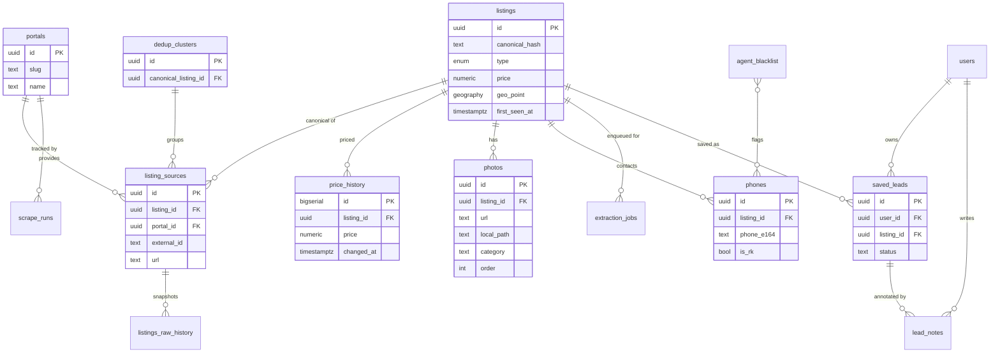

# SecPro Data Architecture

> **Status:** Draft v1 — greenfield design for the Supabase-backed rebuild of SecPro (Slovak real-estate aggregator).
> **Owner:** Backend / Data.
> **Audience:** Everyone building the API, scrapers, AI extraction pipeline, and broker UI.

This document defines the full Postgres schema, indexing strategy, deduplication algorithm, photo storage model, search patterns, partitioning plan, and migration path from the current Upstash Redis implementation. It is the single source of truth for backend work.

---

## 1. Context & Constraints

| Aspect | Value |
|---|---|
| Database | Supabase (managed Postgres 15) + PostGIS + Supabase Storage + Supabase Auth |
| Portals scraped | 9 today (bazos, nehnutelnosti, topreality, reality.sk, bazar, bezrealitky, trh, byty, pozemky) + fb_marketplace reserved |
| Ingest rate | ~1,000 listings/hour (burst), ~1–5k new/day sustained |
| Target corpus | 50k–500k active + historical listings |
| Broker search latency | **p95 < 500 ms** with 10+ simultaneous filters |
| Deduplication | **Strict cross-portal**: one canonical property may reference N portal sources |
| Price history | Every price change kept **forever** |
| Photos | Hybrid — URLs for everyone, binary in Storage only for saved leads |
| Privacy | Phone extraction + RK detection is load-bearing for "private seller only" filter |
| AI | Gemini 2.0 Flash for structured extraction + vision classification of photos |

### Key design decisions (the "why" for the rest of the doc)

1. **Canonical `listings` table is the one brokers query.** All ranking, filtering, and search happens on this table. Raw per-portal rows live in `listing_sources`. This split is the reason deduplication works cleanly.
2. **Extracted structured fields are first-class columns**, not JSONB blobs. Broker filters are known (type, price, city, rooms, size, etc.) — indexing first-class columns is 5–20× faster than JSONB GIN on a 500k-row table. Free-form or portal-specific extras go in a single `attributes jsonb` column for flexibility.
3. **PostGIS from day 1.** Geo search ("listings within 10 km of a point") is a product commitment and retro-fitting PostGIS on a live table is painful. The incremental cost is trivial.
4. **Append-only history tables** (`listings_raw_history`, `price_history`) are partitioned by month from the start. Cheap to drop old partitions, no vacuum pain.
5. **Supabase Auth + RLS** for broker isolation. `saved_leads`, `lead_notes` are per-user; `listings` is readable by any authenticated broker. No bespoke auth code.
6. **Field names inherited from the current scrapers** where sensible (`title`, `location`, `price`, `size`, `phone`, `agentName` → `seller_name`, `source` → resolved to `portal_id`) so porting the scrapers is a copy-with-rename, not a rewrite.

---

## 2. ERD



---

## 3. Extension Setup

```sql
create extension if not exists "uuid-ossp";
create extension if not exists "pgcrypto";      -- gen_random_uuid, digest
create extension if not exists "postgis";       -- geography(Point)
create extension if not exists "pg_trgm";       -- fuzzy title matching, ILIKE acceleration
create extension if not exists "unaccent";      -- Slovak diacritics in FTS
create extension if not exists "btree_gin";     -- composite GIN with scalar + tsvector
```

Custom FTS config for Slovak (unaccented):

```sql
create text search configuration sk_unaccent ( copy = simple );
alter text search configuration sk_unaccent
    alter mapping for hword, hword_part, word with unaccent, simple;
```

---

## 4. Enum Types

```sql
create type listing_type     as enum ('byt','dom','pozemok','komercny','chata','garaz','iny');
create type listing_operation as enum ('predaj','prenajom');
create type listing_condition as enum ('novostavba','kompletna_rekonstrukcia','ciastocna_rekonstrukcia','povodny_stav','holobyt','vo_vystavbe');
create type seller_type      as enum ('private','agency','developer','unknown');
create type orientation      as enum ('S','J','V','Z','SV','SZ','JV','JZ');
create type parking_type     as enum ('garaz','kryte_state','vonkajsie_state','ziadne');
create type heating_type     as enum ('plyn','dialkove','elektrina','tepelne_cerpadlo','tuhe_palivo','ine','ziadne');
create type lead_status      as enum ('new','contacted','meeting','offer','won','lost','archived');
create type job_status       as enum ('queued','running','succeeded','failed','skipped');
create type photo_category   as enum ('exterior','living_room','bedroom','kitchen','bathroom','floor_plan','view','garden','garage','other');
```

Rationale for enums over text: type safety at the DB layer prevents scraper typos (`"byty"` vs `"byt"`) from polluting the canonical table. Adding a value later is `alter type ... add value` — cheap.

---

## 5. Core Tables — DDL

### 5.1 `portals`

Seed table — one row per scraper source.

```sql
create table portals (
  id            uuid primary key default gen_random_uuid(),
  slug          text unique not null,                -- 'bazos', 'nehnutelnosti', ...
  name          text not null,                      -- Display name
  base_url      text not null,
  is_active     boolean not null default true,
  priority      smallint not null default 100,      -- Lower = preferred source when dedup picks canonical
  scrape_interval_minutes int not null default 60,
  notes         text,
  created_at    timestamptz not null default now()
);
```

### 5.2 `users` (brokers)

Thin shadow of `auth.users`. Supabase Auth owns credentials; we keep business fields here.

```sql
create table users (
  id            uuid primary key references auth.users(id) on delete cascade,
  email         text not null unique,
  full_name     text,
  phone         text,
  company_name  text,
  role          text not null default 'broker',     -- 'broker','admin','viewer'
  settings      jsonb not null default '{}',
  created_at    timestamptz not null default now(),
  last_seen_at  timestamptz
);
```

### 5.3 `listings` — the canonical entity

This is the table brokers hit on every search. Every column is commented.

```sql
create table listings (
  -- Identity ------------------------------------------------------------------
  id                      uuid primary key default gen_random_uuid(),
  canonical_hash          text unique,              -- Stable dedup key (see §7). Null until first hash.

  -- Type & operation ----------------------------------------------------------
  type                    listing_type not null,    -- byt / dom / pozemok / ...
  subtype                 text,                     -- '2-izbovy','rodinny_dom','novostavba','apartman'
  operation               listing_operation not null,

  -- Pricing -------------------------------------------------------------------
  price                   numeric(12,2),            -- Current price, currency in price_currency
  price_currency          char(3) not null default 'EUR',
  price_per_sqm           numeric(10,2),            -- Computed: price/size_usable_m2 (generated col below)
  price_negotiable        boolean,                  -- "Dohodou" detected

  -- Size ----------------------------------------------------------------------
  size_m2                 numeric(8,2),             -- Headline square meters (per portal's definition)
  size_usable_m2          numeric(8,2),             -- Uzitkova plocha
  size_land_m2            numeric(10,2),            -- Pozemok (for domy/pozemky)
  rooms                   smallint,                 -- Count of rooms (izby)
  bathrooms               smallint,

  -- Building ------------------------------------------------------------------
  floor                   smallint,                 -- Poschodie of the unit
  total_floors            smallint,                 -- Building total
  condition               listing_condition,
  construction_year       smallint,
  year_last_renovation    smallint,
  energy_class            char(1),                  -- 'A','B','C','D','E','F','G'
  orientation             orientation,
  parking                 parking_type,
  heating_type            heating_type,

  balcony                 boolean,
  terrace                 boolean,
  loggia                  boolean,
  cellar                  boolean,                  -- Pivnica
  elevator                boolean,                  -- Vytah
  furnished               boolean,

  -- Location ------------------------------------------------------------------
  country                 char(2) not null default 'SK',
  region                  text,                     -- Kraj: 'Bratislavsky'...
  district                text,                     -- Okres: 'Bratislava II'
  city                    text,                     -- 'Bratislava'
  city_district           text,                     -- 'Ruzinov'
  street                  text,
  street_number           text,
  postal_code             text,                     -- '821 01'
  geo_point               geography(Point, 4326),   -- WGS84, geocoded by address

  -- Seller --------------------------------------------------------------------
  seller_type             seller_type not null default 'unknown',
  seller_name             text,                     -- RK name if agency; NULL if private/unknown
  is_rk                   boolean generated always as (seller_type = 'agency') stored,
  phone_primary           text,                     -- E.164 normalized
  has_verified_phone      boolean not null default false,

  -- Content -------------------------------------------------------------------
  title                   text,
  description_raw         text,                     -- Original portal text
  description_ai_summary  text,                     -- 3-sentence Gemini brief

  -- Free-form extras (portal-specific fields not worth a column) --------------
  attributes              jsonb not null default '{}',

  -- Lifecycle -----------------------------------------------------------------
  first_seen_at           timestamptz not null default now(),
  last_seen_at            timestamptz not null default now(),
  posted_at_portal        timestamptz,              -- When seller posted on ANY portal (min across sources)
  is_active               boolean not null default true,
  removed_at              timestamptz,

  -- Derived scores (updated by jobs) -----------------------------------------
  freshness_score         real,                     -- 0..1, decays with last_seen_at age
  quality_score           real,                     -- 0..1, completeness of fields
  search_rank             real,                     -- composite for ORDER BY in broker UI

  -- Full-text -----------------------------------------------------------------
  search_tsv              tsvector generated always as (
    setweight(to_tsvector('sk_unaccent', coalesce(title,'')), 'A') ||
    setweight(to_tsvector('sk_unaccent', coalesce(city,'')||' '||coalesce(city_district,'')||' '||coalesce(street,'')), 'B') ||
    setweight(to_tsvector('sk_unaccent', coalesce(description_raw,'')), 'C')
  ) stored,

  -- Timestamps ----------------------------------------------------------------
  created_at              timestamptz not null default now(),
  updated_at              timestamptz not null default now(),

  constraint price_non_negative check (price is null or price >= 0),
  constraint size_non_negative  check (size_m2 is null or size_m2 >= 0),
  constraint rooms_sane         check (rooms is null or rooms between 0 and 50)
);

-- Column comments (abbreviated — apply to each)
comment on column listings.canonical_hash       is 'Stable hash derived from phone + size + city_district + price_bucket. Drives dedup short-circuit before graph merge.';
comment on column listings.price_per_sqm        is 'Price / size_usable_m2. Used heavily by broker analytics.';
comment on column listings.freshness_score      is 'Exponential decay on last_seen_at; drives default sort order in search.';
comment on column listings.quality_score        is 'Completeness of fields 0..1; boosts listings with photos + phone + structured address.';
comment on column listings.attributes           is 'Portal-specific extras not worth a first-class column: e.g. {"ber":"A2","stavky":false}.';
comment on column listings.geo_point            is 'WGS84 point geocoded from address. Null if geocoding failed.';
```

Generated `price_per_sqm` alternative (Postgres 12+):

```sql
alter table listings add column price_per_sqm numeric(10,2)
  generated always as (case when size_usable_m2 > 0 then round(price / size_usable_m2, 2) end) stored;
```

### 5.4 `listing_sources` (M2M listing ↔ portal)

```sql
create table listing_sources (
  id                  uuid primary key default gen_random_uuid(),
  listing_id          uuid not null references listings(id) on delete cascade,
  portal_id           uuid not null references portals(id),
  external_id         text not null,              -- ID assigned by the portal (from scraper's makeId)
  url                 text not null,
  source_title        text,                       -- Title as it appeared on that portal
  source_price        numeric(12,2),              -- Price as seen on this portal last scrape
  source_seller_name  text,
  first_seen_at       timestamptz not null default now(),
  last_seen_at        timestamptz not null default now(),
  is_active           boolean not null default true, -- Still visible on that portal?
  removed_at          timestamptz,
  raw_payload         jsonb,                      -- Latest raw scraper output for debugging
  unique (portal_id, external_id)
);
```

### 5.5 `listings_raw_history` (partitioned)

Every scrape snapshot of every source. Used for diff detection + forensics. Partitioned by month.

```sql
create table listings_raw_history (
  id                  bigserial,
  source_id           uuid not null,              -- references listing_sources(id) — no FK to allow archiving
  scraped_at          timestamptz not null default now(),
  raw_payload         jsonb not null,
  diff_from_previous  jsonb,                      -- JSON-patch-ish summary, null for first snapshot
  primary key (id, scraped_at)
) partition by range (scraped_at);

-- Example monthly partition
create table listings_raw_history_2026_04 partition of listings_raw_history
  for values from ('2026-04-01') to ('2026-05-01');
```

### 5.6 `price_history` (partitioned by year — kept forever)

```sql
create table price_history (
  id              bigserial,
  listing_id      uuid not null references listings(id) on delete cascade,
  source_id       uuid references listing_sources(id) on delete set null,
  price           numeric(12,2) not null,
  price_currency  char(3) not null default 'EUR',
  changed_at      timestamptz not null default now(),
  primary key (id, changed_at)
) partition by range (changed_at);

create index on price_history (listing_id, changed_at desc);
```

### 5.7 `photos`

```sql
create table photos (
  id            uuid primary key default gen_random_uuid(),
  listing_id    uuid not null references listings(id) on delete cascade,
  source_id     uuid references listing_sources(id) on delete set null,
  url           text not null,                    -- Original portal URL — always present
  local_path    text,                             -- Supabase Storage path, null unless downloaded
  phash         bigint,                           -- Perceptual hash for dedup / photo-based similarity
  category      photo_category,                   -- Gemini-classified
  width         int,
  height        int,
  bytes         int,
  "order"       smallint not null default 0,      -- Display order
  is_cover      boolean not null default false,
  downloaded_at timestamptz,
  created_at    timestamptz not null default now(),
  unique (listing_id, url)
);
```

### 5.8 `phones`

```sql
create table phones (
  id             uuid primary key default gen_random_uuid(),
  listing_id     uuid not null references listings(id) on delete cascade,
  phone_e164     text not null,                   -- +421903123456
  phone_display  text,                            -- Original formatting as scraped
  is_rk          boolean not null default false,  -- Known agency phone (from agent_blacklist)
  seen_count     int not null default 1,          -- How often this phone appears across listings (RK signal)
  created_at     timestamptz not null default now(),
  unique (listing_id, phone_e164)
);
```

### 5.9 `agent_blacklist`

Known RK phones/names. Any listing hitting one flips `seller_type='agency'`.

```sql
create table agent_blacklist (
  id            uuid primary key default gen_random_uuid(),
  kind          text not null,                   -- 'phone' | 'name' | 'handle' | 'email'
  value         text not null,                   -- Normalized (E.164 for phone, lowercased for name)
  company_name  text,
  source        text,                            -- 'manual','auto_detected','imported'
  notes         text,
  created_at    timestamptz not null default now(),
  unique (kind, value)
);

create index agent_blacklist_value_idx on agent_blacklist (value);
```

### 5.10 `dedup_clusters`

Stores the union-find graph. One row per edge between two source listings with an attached reason/score.

```sql
create table dedup_clusters (
  id                      uuid primary key default gen_random_uuid(),
  canonical_listing_id    uuid not null references listings(id) on delete cascade,
  created_at              timestamptz not null default now()
);

create table dedup_edges (
  id            bigserial primary key,
  source_a      uuid not null references listing_sources(id) on delete cascade,
  source_b      uuid not null references listing_sources(id) on delete cascade,
  reason        text not null,                   -- 'phone','size_price_geo','title_jaccard','phash'
  score         real not null,                   -- 0..1 confidence
  created_at    timestamptz not null default now(),
  unique (source_a, source_b)
);
```

### 5.11 `extraction_jobs`

AI extraction queue. The scraper writes the raw payload, a worker picks it up and calls Gemini.

```sql
create table extraction_jobs (
  id              uuid primary key default gen_random_uuid(),
  source_id       uuid not null references listing_sources(id) on delete cascade,
  listing_id      uuid references listings(id) on delete set null,
  status          job_status not null default 'queued',
  attempts        smallint not null default 0,
  max_attempts    smallint not null default 3,
  model           text,                          -- 'gemini-2.0-flash'
  prompt_version  text,
  input_hash      text,                          -- Hash of description+title to skip when unchanged
  result          jsonb,
  error           text,
  queued_at       timestamptz not null default now(),
  started_at      timestamptz,
  finished_at     timestamptz
);

create index extraction_jobs_queue_idx on extraction_jobs (status, queued_at) where status in ('queued','failed');
```

### 5.12 `scrape_runs`

```sql
create table scrape_runs (
  id             uuid primary key default gen_random_uuid(),
  portal_id      uuid not null references portals(id),
  started_at     timestamptz not null default now(),
  finished_at    timestamptz,
  status         job_status not null default 'running',
  pages_fetched  int not null default 0,
  listings_seen  int not null default 0,
  new_sources    int not null default 0,
  updated_sources int not null default 0,
  price_changes  int not null default 0,
  errors         int not null default 0,
  error_detail   jsonb
);
```

### 5.13 `saved_leads` + `lead_notes`

```sql
create table saved_leads (
  id            uuid primary key default gen_random_uuid(),
  user_id       uuid not null references users(id) on delete cascade,
  listing_id    uuid not null references listings(id) on delete cascade,
  status        lead_status not null default 'new',
  priority      smallint,                        -- 1..5
  tag           text,
  created_at    timestamptz not null default now(),
  updated_at    timestamptz not null default now(),
  unique (user_id, listing_id)
);

create table lead_notes (
  id            uuid primary key default gen_random_uuid(),
  saved_lead_id uuid not null references saved_leads(id) on delete cascade,
  user_id       uuid not null references users(id) on delete cascade,
  body          text not null,
  created_at    timestamptz not null default now()
);
```

### 5.14 `config`

Key-value table for runtime configuration. Hot-reloadable without deployments.

```sql
create table config (
  key           text primary key,
  value         jsonb not null,
  description   text,
  updated_at    timestamptz not null default now(),
  updated_by    uuid references users(id)
);
```

---

## 6. Indexing Strategy

Broker search is the hot path. All indexes below exist on day 1.

### 6.1 `listings` indexes

| Index | Type | Purpose |
|---|---|---|
| `listings_active_type_op_city_price_idx` | B-tree composite, partial | Primary broker filter combo — covers ~90% of queries |
| `listings_city_district_idx` | B-tree | District drill-down |
| `listings_postal_code_idx` | B-tree | Fast lookup by PSČ |
| `listings_price_idx` | B-tree | Price range slider |
| `listings_size_idx` | B-tree | Size range slider |
| `listings_rooms_idx` | B-tree | Rooms filter |
| `listings_geo_idx` | GIST on `geo_point` | Map / radius search |
| `listings_search_tsv_idx` | GIN | FTS on title + address + description |
| `listings_attributes_idx` | GIN on `jsonb_path_ops` | Flexible queries against portal extras |
| `listings_first_seen_idx` | B-tree DESC | "Added last 7 days" filter and default sort |
| `listings_seller_type_idx` | B-tree, partial | "Private only" filter |
| `listings_phone_primary_idx` | B-tree, partial | "Only listings with phone" |
| `listings_canonical_hash_idx` | B-tree unique | Dedup short-circuit |
| `listings_title_trgm_idx` | GIN trgm | Fuzzy title search |

DDL:

```sql
create index listings_active_type_op_city_price_idx
  on listings (type, operation, city, price)
  where is_active = true;

create index listings_geo_idx  on listings using gist (geo_point) where is_active = true;
create index listings_search_tsv_idx on listings using gin (search_tsv);
create index listings_attributes_idx on listings using gin (attributes jsonb_path_ops);
create index listings_first_seen_idx on listings (first_seen_at desc) where is_active = true;
create index listings_seller_type_idx on listings (seller_type) where is_active = true and seller_type = 'private';
create index listings_phone_primary_idx on listings (phone_primary) where phone_primary is not null;
create index listings_title_trgm_idx on listings using gin (title gin_trgm_ops);
create index listings_price_idx on listings (price) where is_active = true;
create index listings_size_idx on listings (size_usable_m2) where is_active = true;
create index listings_rooms_idx on listings (rooms) where is_active = true;
create index listings_district_idx on listings (district) where is_active = true;
create index listings_city_district_idx on listings (city_district) where is_active = true;
create index listings_postal_code_idx on listings (postal_code) where is_active = true;
```

### 6.2 `listing_sources` indexes

```sql
create index listing_sources_listing_idx on listing_sources (listing_id);
create index listing_sources_active_idx  on listing_sources (portal_id, is_active) where is_active = true;
create index listing_sources_last_seen_idx on listing_sources (portal_id, last_seen_at desc);
```

### 6.3 Partial indexes — why they matter

`where is_active = true` shrinks indexes by 40–60% once we accumulate 6+ months of dead listings. It also speeds up the planner's row-estimation. Every hot filter gets a partial variant on `is_active = true`.

### 6.4 Composite choice reasoning

The primary composite `(type, operation, city, price)` is ordered by **selectivity after typical filtering**:
- `type` (6 values) — almost always set by broker
- `operation` (2 values) — almost always set
- `city` (~3k distinct) — set in ~80% of queries
- `price` — range scan on the tail

This lets the planner narrow to ~1/50th of the table before scanning, then range-scan price in order.

---

## 7. Deduplication Algorithm

Goal: same physical property listed on bazos.sk + nehnutelnosti.sk + topreality.sk ⇒ **one** `listings` row with **three** `listing_sources` rows.

### 7.1 Signals (in order of strength)

| Signal | Weight | Notes |
|---|---|---|
| **Phone match** | 1.0 | Same E.164 phone → almost certainly same ad. Single strongest signal. |
| **pHash photo overlap** | 0.9 | ≥3 photos with Hamming distance ≤6 on 64-bit pHash |
| **Size ±2m² + price ±5% + city_district equal** | 0.8 | Strong structural match |
| **Title Jaccard similarity** | 0.4–0.7 | Tokenize title, remove stopwords + Slovak agency keywords, Jaccard on token set |
| **Street + street_number exact** | 0.75 | Very rare to collide legitimately |

Decision: **accept an edge if cumulative score ≥ 0.85** from any single ≥0.8 signal, or combined from two signals ≥ 0.5 each.

### 7.2 Union-find graph

- Each `listing_source` is a node.
- Each accepted edge is persisted in `dedup_edges`.
- A `listings` row represents one connected component. Its `canonical_hash` is a stable hash of the component's strongest fingerprint (phone if present, else size+district+price-bucket).

### 7.3 Algorithm — on insert

```
1. Scraper writes listing_sources row (raw_payload, url, external_id, portal_id).
2. Extraction worker populates normalized fields and enqueues matcher.
3. Matcher computes candidate set:
   a. same phone_e164 (via phones table) — tightest filter
   b. same city_district AND size_usable_m2 ±2 AND price ±5%
   c. fuzzy title match using pg_trgm (similarity > 0.55) against listings
      scoped to the same city_district
   d. photos with matching phash (Hamming ≤ 6) — only if already downloaded
4. For each candidate pair, compute signal score.
5. If any accept-threshold hits:
     - If candidate belongs to an existing cluster, add our source to that cluster.
     - Else create a new listings row, link both sources to it.
6. Else: create a fresh listings row linked only to this source.
7. Recompute canonical_hash on the listings row from all its sources.
```

### 7.4 Batch reconciliation

Some signals only become available later (pHash needs photos downloaded, phone extraction may arrive late). Every **60 minutes** an hourly job runs:

- Iterate listings updated in the last 90 minutes.
- Re-run the matcher against a wider candidate window.
- If new edges appear, **merge** the resulting clusters: pick the older `listings.id` as winner, re-point `listing_sources`, `photos`, `phones`, `price_history`, `saved_leads` FK, delete the loser row. Merge is transactional.

### 7.5 Merge tie-breakers

When two clusters merge, field values on the surviving `listings` row come from:
- Most complete value wins (non-null > null).
- On ties, value from the **highest-priority portal** wins (portals.priority ascending — e.g. nehnutelnosti=10, bazos=50).
- `first_seen_at` = MIN across the merge.
- `description_raw` = longest.

### 7.6 Manual override

Admin UI exposes "Split cluster" and "Force merge". Both write rows into `dedup_edges` with `reason='manual'` and `score=1.0` (merge) or `-1.0` (split — the resolver treats negative scores as anti-edges).

---

## 8. Incremental Update Flow

What happens on every scrape pass for each listing seen:

```
FOR each raw listing from scraper:
  1. Upsert listing_sources on (portal_id, external_id):
       - first_seen_at: default now() (only set on insert)
       - last_seen_at: now()
       - raw_payload: overwrite
       - is_active: true, removed_at: null
  2. Compute diff vs. previous raw_payload:
       - If price changed → insert into price_history AND update listings.price
       - If description changed → enqueue extraction_jobs (input_hash changed)
       - If any field changed → insert into listings_raw_history
       - If nothing changed → just touch last_seen_at (no other writes)
  3. Update the canonical listings row:
       - last_seen_at = now()
       - is_active = true
       - Recompute freshness_score
```

### 8.1 Stale detection

Nightly job: any `listing_sources` row where `last_seen_at < now() - interval '24 hours'` AND `is_active=true`:
- Mark `is_active=false`, set `removed_at = now()`.
- If **all** sources of a canonical listing are inactive: mark the listing inactive too.

### 8.2 Cost-saving: skip unchanged AI calls

`extraction_jobs.input_hash = sha256(title || '|' || description_raw)`. When the scraper sees an unchanged description, the worker short-circuits to `status='skipped'` and reuses the previous extraction result. This cuts Gemini spend by ~70% on steady-state scrapes (most listings don't change between runs).

---

## 9. Photo Storage Design

### 9.1 Two-tier model

| Tier | Trigger | Storage | URL field |
|---|---|---|---|
| Tier 1 — URL only | All new listings | None (referenced) | `photos.url` |
| Tier 2 — binary in Storage | Saved to any broker's `saved_leads` | Supabase Storage bucket `listing-photos` | `photos.local_path` |

Broker UI displays Tier 1 images directly from the portal CDN. When a broker saves a lead, a background job downloads the photos, computes pHash, calls Gemini Vision for categorization, and generates a 512×512 thumbnail into `listing-photos-thumbs`.

### 9.2 Storage paths

```
listing-photos/{listing_id}/{photo_id}.jpg
listing-photos-thumbs/{listing_id}/{photo_id}_thumb.jpg
```

### 9.3 Photo analysis pipeline

1. Download original → `listing-photos/...`
2. `phash` via `imagehash` library.
3. Gemini Vision prompt: classify category, detect floor plan, extract any visible text.
4. Result upserted into `photos` row.
5. Thumbnail generated via `sharp`.

### 9.4 Why not store all photos upfront

Average listing has 12 photos × 500 KB = **6 MB**. 500k listings = **3 TB** — bandwidth is cheap, Supabase Storage isn't. Saving only on broker intent caps the bill at ~low thousands of photos per broker.

---

## 10. Search Query Patterns

Representative broker queries and the exact SQL. All assume `is_active = true` unless noted.

### 10.1 "Byty v Bratislave-Petržalke, 2-izbové, 150–250k, súkromné, s fotkami, pridané za posledných 7 dní"

```sql
select l.*
from listings l
where l.is_active = true
  and l.type = 'byt'
  and l.operation = 'predaj'
  and l.city = 'Bratislava'
  and l.city_district = 'Petržalka'
  and l.rooms = 2
  and l.price between 150000 and 250000
  and l.seller_type = 'private'
  and l.first_seen_at >= now() - interval '7 days'
  and exists (select 1 from photos p where p.listing_id = l.id)
order by l.first_seen_at desc
limit 100;
```

Uses `listings_active_type_op_city_price_idx` + seller_type partial + first_seen partial.

### 10.2 "Domy v okrese Trenčín do 400k, pozemok min 300m²"

```sql
select l.*
from listings l
where l.is_active
  and l.type = 'dom'
  and l.operation = 'predaj'
  and l.district = 'Trenčín'
  and l.price <= 400000
  and l.size_land_m2 >= 300
order by l.price asc;
```

### 10.3 Geo radius: "Byty do 10 km od GPS (48.1486, 17.1077), max 250k"

```sql
select l.*,
       st_distance(l.geo_point, st_makepoint(17.1077, 48.1486)::geography) as distance_m
from listings l
where l.is_active
  and l.type = 'byt'
  and l.price <= 250000
  and st_dwithin(l.geo_point, st_makepoint(17.1077, 48.1486)::geography, 10000)
order by distance_m asc
limit 200;
```

Uses GiST geo index — milliseconds on 500k rows.

### 10.4 Full-text "panelák rekonštrukcia loggia"

```sql
select l.*, ts_rank(l.search_tsv, q) as rank
from listings l,
     plainto_tsquery('sk_unaccent', 'panelák rekonštrukcia loggia') q
where l.is_active
  and l.search_tsv @@ q
order by rank desc, l.first_seen_at desc
limit 100;
```

### 10.5 Price drop: "listings whose price dropped ≥10k within last 48h"

```sql
with latest as (
  select listing_id,
         max(price) filter (where changed_at < now() - interval '48 hours') as old_price,
         max(price) filter (where changed_at >= now() - interval '48 hours') as new_price
  from price_history
  where changed_at >= now() - interval '14 days'
  group by listing_id
)
select l.*, latest.old_price, latest.new_price, (latest.old_price - latest.new_price) as drop_eur
from latest
join listings l on l.id = latest.listing_id
where latest.old_price - latest.new_price >= 10000
order by drop_eur desc;
```

### 10.6 "Listings appearing on ≥ 3 portals" (duplicates broker wants to see once)

```sql
select l.id, l.title, l.price, count(ls.*) as portal_count
from listings l
join listing_sources ls on ls.listing_id = l.id and ls.is_active
where l.is_active
group by l.id
having count(ls.*) >= 3
order by portal_count desc;
```

### 10.7 Broker's saved pipeline

```sql
select l.*, sl.status, sl.priority, sl.updated_at
from saved_leads sl
join listings l on l.id = sl.listing_id
where sl.user_id = auth.uid()       -- RLS will enforce this even if omitted
  and sl.status in ('new','contacted','meeting')
order by sl.priority asc nulls last, sl.updated_at desc;
```

### 10.8 "Private seller with phone AND photos AND price/m² below city median"

```sql
with city_median as (
  select city, percentile_cont(0.5) within group (order by price_per_sqm) as med
  from listings
  where is_active and type='byt' and operation='predaj' and price_per_sqm is not null
  group by city
)
select l.*
from listings l
join city_median cm on cm.city = l.city
where l.is_active
  and l.seller_type = 'private'
  and l.phone_primary is not null
  and exists (select 1 from photos p where p.listing_id = l.id)
  and l.price_per_sqm < cm.med * 0.85
order by (cm.med - l.price_per_sqm) desc;
```

---

## 11. Row Level Security (RLS)

Enable RLS on every table. Default deny, then explicit allow.

### 11.1 Public-ish (authenticated brokers read)

```sql
alter table listings enable row level security;
create policy "brokers_read_listings" on listings
  for select to authenticated using (true);

alter table listing_sources enable row level security;
create policy "brokers_read_sources" on listing_sources
  for select to authenticated using (true);

alter table photos enable row level security;
create policy "brokers_read_photos" on photos
  for select to authenticated using (true);

alter table phones enable row level security;
create policy "brokers_read_phones" on phones
  for select to authenticated using (true);

alter table price_history enable row level security;
create policy "brokers_read_prices" on price_history
  for select to authenticated using (true);

alter table portals enable row level security;
create policy "brokers_read_portals" on portals
  for select to authenticated using (true);
```

### 11.2 Per-user (saved leads, notes)

```sql
alter table saved_leads enable row level security;
create policy "users_own_saved_leads_select" on saved_leads
  for select to authenticated using (user_id = auth.uid());
create policy "users_own_saved_leads_write"  on saved_leads
  for all to authenticated using (user_id = auth.uid()) with check (user_id = auth.uid());

alter table lead_notes enable row level security;
create policy "users_own_notes" on lead_notes
  for all to authenticated using (user_id = auth.uid()) with check (user_id = auth.uid());
```

### 11.3 Admin-only (scraper ops + agent blacklist management)

```sql
alter table scrape_runs enable row level security;
create policy "admin_scrape_runs" on scrape_runs
  for all to authenticated
  using  ((select role from users where id = auth.uid()) = 'admin')
  with check ((select role from users where id = auth.uid()) = 'admin');

-- Same pattern for extraction_jobs, listings_raw_history, dedup_edges, dedup_clusters,
-- agent_blacklist, config.
```

### 11.4 Service-role writes

Scrapers and AI workers run with the Supabase `service_role` key, which bypasses RLS. Brokers never write directly to `listings` — they only read and manage their own `saved_leads`.

---

## 12. Partitioning & Archiving

| Table | Partitioning | Retention | Notes |
|---|---|---|---|
| `listings_raw_history` | RANGE by `scraped_at` monthly | **6 months** hot, then archive to cold storage (Supabase `archive` schema or S3 export) | Drop partition is O(1) |
| `price_history` | RANGE by `changed_at` yearly | **Forever** | Data volume is tiny — price changes are rare |
| `listings` | Not partitioned initially. If it exceeds 2M rows, partition hash(id) into 4 shards. | Inactive for >30 days → move to `listings_archive` table with identical schema | Keeps hot table small for planner |
| `extraction_jobs` | Not partitioned. | Succeeded rows truncated after 30 days; failed rows kept indefinitely | |
| `scrape_runs` | Not partitioned. | 180 days | |

### Partition maintenance

A nightly `pg_cron` job creates the next month's partition for `listings_raw_history` 7 days before it's needed and drops partitions older than 6 months:

```sql
-- Pseudocode called by pg_cron
create table listings_raw_history_2026_05 partition of listings_raw_history
  for values from ('2026-05-01') to ('2026-06-01');

drop table listings_raw_history_2025_10;
```

### Archive move for cold listings

```sql
-- Once a day
with stale as (
  select id from listings
  where is_active = false and removed_at < now() - interval '30 days'
  limit 10000
)
insert into listings_archive select l.* from listings l join stale using (id);
delete from listings using stale where listings.id = stale.id;
```

---

## 13. Seeding Script Outline

Run once on a fresh Supabase project, after migrations.

### 13.1 Portals

```sql
insert into portals (slug, name, base_url, priority) values
  ('nehnutelnosti', 'Nehnuteľnosti.sk', 'https://www.nehnutelnosti.sk', 10),
  ('topreality',    'TopReality.sk',    'https://www.topreality.sk',    20),
  ('reality',       'Reality.sk',       'https://www.reality.sk',       30),
  ('bezrealitky',   'Bezrealitky.sk',   'https://www.bezrealitky.sk',   40),
  ('bezmaklerov',   'Bezmaklerov.sk',   'https://www.bezmaklerov.sk',   45),
  ('bazos',         'Bazos.sk',         'https://reality.bazos.sk',     50),
  ('bytysk',        'Byty.sk',          'https://www.byty.sk',          60),
  ('bytsk',         'Byt.sk',           'https://www.byt.sk',           60),
  ('mojereality',   'MojeReality.sk',   'https://www.mojereality.sk',   70),
  ('fb_marketplace','Facebook Marketplace','https://www.facebook.com/marketplace', 80);
```

### 13.2 Config defaults

```sql
insert into config (key, value, description) values
  ('scrape_interval_minutes', '60',    'Default interval between scrape passes'),
  ('ai_model',                '"gemini-2.0-flash"', 'Model for structured extraction'),
  ('ai_prompt_version',       '"v1"',  'Prompt version; bump to force re-extraction'),
  ('dedup_accept_threshold',  '0.85',  'Minimum score to merge two sources'),
  ('freshness_halflife_days', '14',    'Half-life for freshness_score decay'),
  ('proxy_pool',              '[]',    'Outbound proxy endpoints for scrapers');
```

### 13.3 Agent blacklist seed

Pre-populate with ~50 known Slovak RK phone numbers, agency names, and known RK handles sourced from current SecPro data. Example:

```sql
insert into agent_blacklist (kind, value, company_name, source) values
  ('name',  're/max',           'RE/MAX',          'manual'),
  ('name',  'century 21',       'Century 21',      'manual'),
  ('name',  'herrys',           'HERRYS',          'manual'),
  ('name',  'lexxus',           'LEXXUS',          'manual'),
  ('phone', '+421903111111',    'Example RK s.r.o.','manual');
```

---

## 14. Migration Plan: Upstash Redis → Supabase

### 14.1 Current Redis contents (from `lib/kv.js` and API routes)

| Key pattern | Purpose | Destination |
|---|---|---|
| `session:{token}` | Auth session | **Stay in Redis (or Supabase Auth)** |
| `user:{id}` | Broker profile | `users` table |
| `saved_lead:{user}:{id}` | Saved listing | `saved_leads` table |
| `contact:{user}:{id}` | Contact notes | `lead_notes` table |
| `aml:{id}` | AML check records | `aml_records` table (outside this doc's scope — separate schema) |
| `listing:{id}` (if used) | Hot listing cache | `listings` table (Postgres with indexes is fast enough) |

### 14.2 What stays in Redis

- **Session tokens only.** Supabase Auth gives us JWT sessions for free — even sessions can move. Redis keeps a role as a rate-limit / per-IP scratch space if needed, but is not a system of record.

### 14.3 Migration steps

1. **Schema live** on a staging Supabase project; seed portals + config.
2. **Dual-write** period: API writes to both Redis and Postgres for `saved_leads`, `lead_notes`, `users`. Reads still go to Redis.
3. **Backfill script** (`scripts/migrate-redis-to-postgres.js`) reads every key matching the patterns above and inserts into Postgres. Idempotent — re-runnable.
4. **Switch reads** to Postgres. Keep Redis writes mirrored for 14 days as safety net.
5. **Stop Redis writes** for migrated keys. Keep `session:*`.
6. **Shut down Upstash** once all non-session data has aged out.

### 14.4 Scraper migration

Current scrapers return objects like:

```js
{ id, source, title, address, location, price, priceText, phone, url, type, size, imageUrl, agentName, scrapedAt }
```

Mapping to new schema:

| Scraper field | Target |
|---|---|
| `id` | `listing_sources.external_id` (portal-scoped id) |
| `source` | Resolved to `listing_sources.portal_id` |
| `title` | `listing_sources.source_title` → eventually `listings.title` |
| `address` + `location` | Parsed → `listings.street`, `city`, `city_district`, `district`, `postal_code`, `geo_point` |
| `price` | `listing_sources.source_price` → `listings.price` + `price_history` |
| `priceText` | Dropped (derivable from `price`) |
| `phone` | `phones.phone_e164` (normalized) + `listings.phone_primary` |
| `url` | `listing_sources.url` |
| `type` | `listings.type` |
| `size` | `listings.size_m2` |
| `imageUrl` | First row in `photos` with `order=0, is_cover=true` |
| `agentName` | `listings.seller_name`; triggers `seller_type='agency'` lookup |
| `scrapedAt` | `listing_sources.last_seen_at` |

Scrapers change from returning JSON to calling a single `ingestSource({ portal_slug, external_id, raw })` RPC. That RPC does the upsert + diff + history writes transactionally.

### 14.5 AML / financial calculators

Out of scope for this schema — they live in a separate `compliance` schema with their own tables. Noted here only because the Redis migration script needs to know which keys to leave alone.

---

## 15. Derived Scores — formulas

Both scores run in a nightly refresh job (single UPDATE over inactive-filter subset).

### 15.1 `freshness_score`

```
halflife_days = config.freshness_halflife_days  -- default 14
age_days      = extract(epoch from now() - last_seen_at) / 86400
freshness     = 2 ^ (-age_days / halflife_days)
```

Clamped to `[0,1]`.

### 15.2 `quality_score`

Weighted completeness — 1.0 means every field is populated and has at least 5 photos.

| Component | Weight |
|---|---|
| Has price | 0.10 |
| Has size_usable_m2 | 0.10 |
| Has rooms | 0.05 |
| Has geo_point | 0.15 |
| Has ≥ 3 photos | 0.15 |
| Has phone_primary | 0.15 |
| Has street + number | 0.10 |
| Has description ≥ 200 chars | 0.10 |
| Has construction_year | 0.05 |
| Has energy_class | 0.05 |

### 15.3 `search_rank`

```
search_rank = 0.6 * freshness_score
            + 0.3 * quality_score
            + 0.1 * (case when seller_type = 'private' then 1 else 0 end)
```

Used in default search ordering (`order by search_rank desc`).

---

## 16. Operational Notes

- **VACUUM/ANALYZE**: Postgres autovacuum defaults are fine except on `listings_raw_history` — set `autovacuum_vacuum_scale_factor = 0.01` because partitions churn fast.
- **Connection pooling**: Use Supabase's built-in PgBouncer in transaction mode. Scrapers are bursty — they MUST share a pool.
- **Observability**: Log every long query (>500 ms) into `slow_queries` table via `pg_stat_statements`.
- **Backups**: Supabase daily PITR. Additionally, weekly `pg_dump` of `listings`, `listing_sources`, `price_history` to S3 — these are the irreplaceable tables.

---

## 17. Open Questions / Future Work

1. **Vector search** for semantic listing similarity — pgvector extension; `description_embedding vector(768)` column; index with IVF-Flat. Not needed for v1 but hooks should be there.
2. **Portal-specific raw schemas** — currently all raw_payloads go into one jsonb column. If portals diverge wildly we may split into per-portal staging tables.
3. **User-defined saved searches with alerts** — a `saved_searches` table + `notification_queue`. Straightforward extension.
4. **Fraud / duplicate-photo detection** across listings — pHash clustering at the photo level, orthogonal to listing dedup. Same index but different query.
5. **FB Marketplace scraping** — likely requires auth/headless browser; schema already supports it via the reserved `fb_marketplace` portal row.

---

## Appendix A — Minimum viable migration order

1. Enable extensions, create enums.
2. Create `portals`, `users`, `config`, `agent_blacklist`.
3. Create `listings` with indexes.
4. Create `listing_sources`, `listings_raw_history` (with partitions).
5. Create `price_history` (with partitions).
6. Create `photos`, `phones`.
7. Create `dedup_clusters`, `dedup_edges`.
8. Create `extraction_jobs`, `scrape_runs`.
9. Create `saved_leads`, `lead_notes`.
10. Enable RLS and apply policies.
11. Seed portals + config + blacklist.
12. Port one scraper (bazos) end-to-end via `ingestSource` RPC as smoke test.
13. Port remaining scrapers in parallel.

---

## Appendix B — Field mapping quick reference

For developers porting scrapers, this one-liner of the mapping:

```
makeId(source, id)    → listing_sources.external_id (strip prefix)
source                → portal_id via portals.slug
title                 → source_title → listings.title
location              → parsed → city + city_district + district
address               → parsed → street + street_number
price                 → price + price_history row
phone                 → phones.phone_e164 (E.164) + listings.phone_primary
agentName             → seller_name; seller_type=agency if agent_blacklist hit or isAgencyListing()
imageUrl              → photos (order=0, is_cover=true)
scrapedAt             → last_seen_at
```

---

*End of document.*
