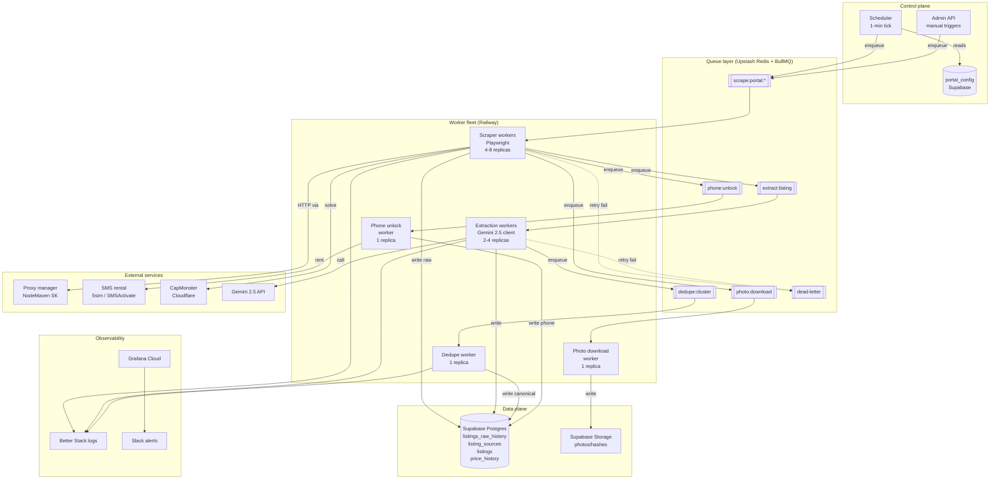

# Ingestion Orchestration Architecture

**Project:** secpro — Slovak real estate aggregator
**Scope:** ingestion pipeline for 9 portals, ~1000 listings/hour, Supabase Postgres sink
**Audience:** DevOps / backend engineers building and operating the pipeline
**Status:** design doc, v1

---

## 0. Executive summary

secpro ingests listings from nine Slovak real-estate portals on a configurable cadence (default: **1 hour**), runs AI extraction, de-duplicates across portals, and writes canonical records into Supabase. The target scale is modest (~24k listings/day, ~720k/month) but the operational demands are not: multiple portals actively defend against scraping (headless fingerprinting, SMS-gated phones, Cloudflare, geo-walls, account-gated detail pages). This document defines the orchestration layer — scheduler, queue, workers, proxies, anti-bot toolkit, monitoring, and rollout — that lets a small team operate the pipeline without constant babysitting.

**Key architectural choices, in one sentence each:**

- **Hosting:** Railway for workers (simplest containerized platform, cheap scaling, no cold-start tax on long-running Playwright).
- **Queue:** BullMQ on Upstash Redis (mature, DLQ / retries / priorities out of the box; Redis is also the proxy/session cache).
- **Scheduler:** single `tick` worker running every 60 s, reads `portal_config.next_run_at` from Supabase and enqueues due jobs. No separate cron infra.
- **Browser tier:** Playwright with `rebrowser-patches` (stealth) + residential proxies (NodeMaven for SK IPs; Bright Data as fallback).
- **Phone unlock:** per-portal strategy — cookie-replay where possible, rented SMS accounts only for bazos.sk, skip-and-flag where neither works.
- **Dedup:** async worker triggered by extraction completion, canonical clustering via (phone, lat/lng±50m, area±3m², price±5%) signature.

**Total monthly cost estimate at steady state: ~$470/mo** (detailed in §14).

---

## 1. System topology

### 1.1 Diagram



### 1.2 Component rationale

| Component | Choice | Why |
|---|---|---|
| **Scheduler** | Single Node process, 60 s tick loop on Railway | One cron artifact to reason about. Supabase `pg_cron` works but hides logic in DB, harder to debug; Vercel cron has 10s execution cap and doesn't integrate with our queue. |
| **Queue** | BullMQ on Upstash Redis | Priorities, delayed jobs, rate limits, DLQ, repeatable jobs — all out of the box. Upstash Redis is per-request priced (~$10/mo for our volume). Pg_queue (`supabase_queue`/`pgmq`) is viable but immature tooling (no UI, weaker retry primitives). QStash is HTTP-only and can't do long-running scrape jobs elegantly. |
| **Scraper workers** | Playwright + rebrowser-patches on Railway (Docker) | Long-lived browsers, need stable memory + disk. Serverless is disqualified (timeouts, cold starts tax Playwright heavily). Railway gives horizontal scale by replicas with one click. |
| **Extraction workers** | Same fleet, different image | Stateless API calls to Gemini. Could be serverless but sharing the Railway project simplifies secrets + logs. |
| **Dedupe worker** | Single replica, Node | Avoid race conditions in clustering; Postgres advisory locks per cluster id handle concurrency. |
| **Proxy manager** | Thin Node wrapper around NodeMaven residential pool | Sticky sessions, health stats in Redis, single source of truth for IP state. |
| **SMS unlock service** | 5sim or SMSActivate API | Cheapest SK numbers (~$0.10/rental). Wrapped in its own worker to keep credentials isolated. |
| **Monitoring** | Grafana Cloud free tier + Better Stack logs | Grafana free tier supports our metric volume. BullMQ ships Prometheus metrics. |
| **DB** | Supabase Postgres Pro | Already chosen by user; RLS, auth, storage in one bundle. |

---

## 2. Hosting decision — worker infrastructure

### 2.1 Trade-off matrix

| Platform | Baseline cost | Pros | Cons | Recommended? |
|---|---|---|---|---|
| **Vercel serverless** | $0-20 | Trivial deploy, cron built in | 10s default / 60s pro / 300s enterprise function cap kills Playwright runs that average 20-120s per listing; Playwright cold-start ~3s per invocation is brutal; no persistent Redis co-located; ephemeral `/tmp` only | ❌ No |
| **Railway** | ~$20 base + ~$0.01/GB-hr | 1-click Docker, horizontal replicas, private networking, built-in Redis/Postgres, observability panel | Egress is metered (watch proxy traffic billing); not free; region limited (US/EU only, no direct SK) | ✅ **Yes** |
| **Fly.io** | ~$15-30 for small VMs | Deploy to Frankfurt (closest to SK), Machines API for on-demand spin-up, good for burst | Operational model (machines vs apps) has a steeper learning curve; historic platform instability; crashloop handling weaker than Railway | Runner-up |
| **AWS Lambda + SQS** | Pay-per-ms | Infinite scale, SQS rock-solid | Playwright in Lambda needs the chromium-layer hack (~250MB layer limit); 15-min cap is fine but cold starts make p95 latency bad; tangled IAM/VPC if proxy needs VPC egress; most dev time sink | ❌ No |
| **Dedicated VPS (Hetzner)** | €4-15/mo for CX22/CX32 | Cheapest raw compute in Europe, Falkenstein/Nuremberg close to SK, unmetered egress | You run it: systemd, nginx, log shipping, security patching. Reasonable for month-2 hardening, not week-1. | Phase-2 consideration |
| **Browserless.io** | $50-200/mo | Fully managed Playwright, residential proxy pre-integrated, solves Cloudflare | Per-session pricing spikes fast at our 1000/hr rate; you pay $2/GB for proxy; locked into their stack | Fallback only |

**Current Vercel limits (as of early 2026) relevant here:** Hobby functions 10s, Pro 60s (or up to 300s on Fluid Compute), Enterprise 900s. All lack persistent state. Cron supports minute granularity on Pro+. Disqualifying factor: running a Playwright listing-detail scrape reliably within 60 s is a coin flip once anti-bot latency is added. Don't fight this.

### 2.2 Recommendation: **Railway**

- **Services**: one Node service per queue (`scraper`, `extractor`, `dedupe`, `phone-unlock`, `photo`, `scheduler`, `admin-api`) — 7 services, shared monorepo.
- **Resource sizing (month-1)**:
  - scraper: 2 replicas × 1 vCPU / 2 GB = ~$15/mo
  - extractor: 1 replica × 0.5 vCPU / 512 MB = ~$5/mo
  - others: 0.25 vCPU / 256 MB, ~$2/mo each
- **Scaling trigger**: queue depth > 500 jobs → add scraper replica (manual for now, Railway has autoscaling in beta).
- **Railway monthly estimate**: **~$40-60** at steady state, up to ~$100 during full catch-up scrapes.

---

## 3. Scheduler design

### 3.1 Principles

1. Single scheduler process, runs `tick()` every 60 s.
2. All scheduling state lives in Postgres — the scheduler is stateless and restart-safe.
3. Portals are staggered: no two portals scrape at the same minute within the same cycle.
4. Failures produce exponential backoff on `next_run_at`.
5. Manual/admin triggers are a queue push, not a scheduler bypass.

### 3.2 `portal_config` table

```
portal_config
-------------
id              text pk           -- 'bazos', 'nehnutelnosti', ...
enabled         bool
interval_sec    int               -- default 3600
next_run_at     timestamptz       -- scheduler reads this
last_run_at     timestamptz
last_status     text              -- 'ok'|'fail'|'partial'
consecutive_failures int
backoff_factor  numeric           -- 1.0 baseline, doubled on fail up to cap
stagger_offset_sec int            -- 0..interval_sec for staggering
scraper_version text              -- for canary deploy
```

### 3.3 `tick()` behaviour (pseudo)

```
now = clock()
SELECT id FROM portal_config
  WHERE enabled = true
    AND next_run_at <= now
  FOR UPDATE SKIP LOCKED
  LIMIT 9

for each row:
    enqueue scrape:portal:<id> with idempotency key '<id>:<floor(now/60s)>'
    UPDATE portal_config
      SET next_run_at = now + interval_sec * backoff_factor + stagger_offset_sec,
          last_run_at = now
      WHERE id = row.id
```

`FOR UPDATE SKIP LOCKED` makes the scheduler safe to run twice accidentally (e.g., during a rolling deploy).

### 3.4 Stagger assignment

When a portal is added, its `stagger_offset_sec = hash(portal_id) mod interval_sec`. With 9 portals and 3600 s interval, portals naturally spread across the hour — no two hit within the same minute on average.

### 3.5 Backoff policy

```
on success     → backoff_factor = max(1.0, backoff_factor * 0.5), failures = 0
on partial     → backoff_factor unchanged
on hard fail   → failures += 1, backoff_factor = min(8.0, 1.5 ^ failures)
```

Max backoff = 8× interval (so default 8 h before we re-try a dead portal). After 3 consecutive failures, emit an alert.

### 3.6 Manual trigger

`POST /admin/scrape { portal: "bazos", force: true }` → directly enqueues a `scrape:portal:bazos` job with priority=high, bypassing `next_run_at`. Used during development, deploys, and incident recovery.

---

## 4. Queue design

### 4.1 Tech choice

**BullMQ on Upstash Redis.** Rationale:

| Option | Verdict |
|---|---|
| **BullMQ + Upstash** | Native Node, supports priorities, repeatable jobs, delayed jobs, rate limits, DLQ, sandboxed processors, QueueEvents for observability. Large ecosystem of dashboards (BullBoard). ✅ |
| **pgmq / supabase_queue** | Postgres-native (nice, zero extra infra), but weaker primitives: no priorities, weaker rate-limit story, no native DLQ pattern, ecosystem thin. Viable for extract queue, not scrape queue. |
| **Upstash QStash** | HTTP-delivered, scales infinitely, but no persistent consumer pattern — must be pull+webhook. Awkward for long-running scrape workers. |
| **SQS** | Fine but extra AWS account, worse DX, no priority lanes. |

### 4.2 Queue structure

| Queue | Purpose | Producer | Consumer | Priority lanes | Retries | TTL |
|---|---|---|---|---|---|---|
| `scrape:portal:bazos` (1 per portal) | Run full scrape cycle | scheduler / admin | scraper | 1=manual, 5=scheduled | 3, exp backoff 30s/2m/10m | 2 h |
| `scrape:listing` | Fetch a single detail page | scraper (list phase) | scraper (detail phase) | 1=new, 5=update | 3, exp backoff | 1 h |
| `extract:listing` | AI extraction | scraper | extractor | 1=new, 5=re-extract | 5 | 24 h |
| `dedupe:cluster` | Re-evaluate a canonical cluster | extractor | dedupe worker | 5 | 3 | 1 h |
| `phone:unlock` | Unlock phone behind gate | scraper | phone unlock worker | 5=batch, 1=broker-requested | 2 | 24 h |
| `photo:download` | Download/hash photos when needed | broker save event | photo worker | 1=broker-requested | 3 | 7 d |
| `_deadletter` | Failed jobs retained for inspection | system | manual | — | — | 14 d |

### 4.3 Idempotency keys

Every enqueue uses a deterministic jobId:

- Scrape: `scrape:<portal>:<floor(ts/60s)>`
- Detail: `detail:<portal>:<listing_id_on_portal>:<hash_of_list_snapshot>`
- Extraction: `extract:<source_id>:<raw_history_id>`
- Dedupe: `dedupe:<canonical_cluster_id>`

Repeat enqueues are no-ops (BullMQ deduplicates by jobId by default).

### 4.4 Retry semantics

- Transient failures (HTTP 5xx, timeout, proxy timeout) → retry with backoff.
- Anti-bot block (403, Cloudflare challenge, captcha fail) → retry once with fresh proxy; after that, move to DLQ and alert.
- Parse error (HTML structure mismatch) → **do not retry**, directly DLQ, high-priority alert (portal changed layout).
- DB constraint error → retry twice; if persistent, DLQ and alert.

### 4.5 Priority policy

- New listing > price update > unchanged revisit. Encoded via priority numeric (lower = higher priority in BullMQ).
- Broker-requested actions (e.g., photo download when a lead is saved) always run at priority 1.

---

## 5. Scraper worker design

### 5.1 Worker loop (pseudo)

```
on job 'scrape:portal:<name>':
    cfg = portal_config[name]
    session = proxyManager.getStickySession(portal=name, ttl=1h)

    # 1. List phase — paginate through "latest" listings
    stubs = []
    for page in 1..cfg.max_pages:
        html = fetch(list_url(page), session, retries=3)
        stubs += parseList(html)  # [{portal_id, url, title, price_hint, posted_at}]
        if seenRecentlyAll(stubs[-page_size:]): break  # early exit when we hit already-known cursor

    # 2. Dedup against listing_sources to decide "new" vs "update" vs "unchanged"
    stubHashes = {s.portal_id: hash(s.title + s.price_hint) for s in stubs}
    existing = SELECT portal_id, content_hash, last_seen_at
                 FROM listing_sources
                 WHERE portal = name AND portal_id = ANY(stubs.ids)

    for stub in stubs:
        prev = existing[stub.portal_id]
        if prev is None:
            enqueue('scrape:listing', { portal, stub, action: 'new' }, priority=1)
        elif prev.content_hash != stubHashes[stub.portal_id]:
            enqueue('scrape:listing', { portal, stub, action: 'update' }, priority=5)
        else:
            UPDATE listing_sources SET last_seen_at = now()
              WHERE portal = name AND portal_id = stub.portal_id
    mark job success
    portal_config.update(status='ok')

on job 'scrape:listing':
    session = proxyManager.getStickySession(portal, ttl=1h)
    page = browser.newPage(session)
    gotoWithStealth(page, stub.url)
    html = page.content()
    data = parseDetail(html, portal)

    content_hash = sha256(data.title + data.description + data.price)
    raw_id = INSERT INTO listings_raw_history(portal, portal_id, raw_html, parsed, content_hash, scraped_at)

    UPSERT listing_sources(portal, portal_id, content_hash, last_seen_at, raw_history_id=raw_id)

    if data.price_changed_vs_prev:
        INSERT INTO price_history(source_id, old_price, new_price, changed_at)

    if data.phone_gated:
        enqueue('phone:unlock', { source_id, portal, portal_id }, priority=5)
    if not data.phone_gated and data.phone:
        UPDATE listing_sources SET phone = data.phone

    enqueue('extract:listing', { source_id, raw_history_id: raw_id }, priority=(new ? 1 : 5))
    # Photos: download URLs only, don't download bytes until a broker saves the lead
    UPDATE listing_sources SET photo_urls = data.photo_urls
```

### 5.2 Why two-phase (list → detail)

- List page is a cheap signal-per-byte: one fetch yields 20-50 stubs.
- Most scrape cycles are "nothing new" on the hot portals — list phase alone closes them in 2-5 s, no detail fetches needed.
- Detail fetches are where Playwright + proxy cost lives; minimizing them is how we keep this cheap.

### 5.3 Browser pooling

- Each scraper replica keeps a pool of 3-5 browser contexts per portal (isolated cookies per portal).
- Context reused across jobs for ~30 minutes, then recycled to refresh fingerprint.
- One browser per process (Chromium eats RAM; 1 GB per instance is realistic with 5 open pages).

### 5.4 Cookie persistence

- After a successful detail fetch, cookies are serialized to `portal_sessions` table keyed by (portal, session_id).
- On next job, load cookies → re-use them — this is the single biggest win against bot detection (returning visitors are scored differently).

---

## 6. Proxy strategy

### 6.1 Why residential

Datacenter proxies get blocked by all nine portals within hours. Residential (real ISP-allocated IPs) passes 99% of the time. Mobile proxies are overkill here.

### 6.2 Provider comparison

| Provider | Cost (10 GB/mo) | SK IP availability | Sticky sessions | Notes |
|---|---|---|---|---|
| **NodeMaven** | ~$60 | Good | Up to 24 h | Best SK coverage, good uptime. ✅ primary |
| Bright Data | ~$80-120 | Excellent | Configurable | Premium, enterprise contracts push up price. Keep as fallback. |
| Smartproxy (Decodo) | ~$70 | OK | 10 min max | Good API, sticky window too short for our cycle |
| IPRoyal | ~$35 | Medium | Up to 1 h | Cheap, quality inconsistent; consider for lower-risk portals |

**Recommendation:** NodeMaven primary pool (~$60/mo for ~10 GB), IPRoyal as cost-saving tier for list-page fetches, Bright Data as emergency fallback behind a flag.

### 6.3 Rotation policy

- **Sticky session per (portal, hour)** — one IP stays assigned for an entire scrape cycle so cookies/fingerprint are consistent. Switch IP only when:
  - the session returns 403/429
  - captcha appears twice in a row
  - cycle duration exceeds 2 h (stale session)
- IPs are held in Redis: `proxy:portal:bazos:session:abc123 → {ip, assigned_at, health_score}`.
- Health score decremented on each failure; session evicted and replaced when score < 0.5.

### 6.4 Geo-targeting

All nine portals are Slovak-audience sites. **Require SK IP exit** — at minimum EU, ideally SK. NodeMaven and Bright Data both support country=SK filter. Datacenter checks (e.g. `bazos.sk`) pass with Slovak ISP IPs; foreign IPs sometimes see captcha sooner or get geo-walled content.

### 6.5 Bandwidth budget

~1000 listings/hr × ~500 KB per detail page × 24 h = ~12 GB/day if everything is new. In reality, with "unchanged" short-circuit and list-page early-exit, expect **~2-4 GB/day**. Budget $60/mo on NodeMaven, upgrade if we hit 20 GB.

---

## 7. Anti-bot bypass toolkit

### 7.1 Core techniques

| Technique | When to use | Implementation note |
|---|---|---|
| **Playwright + rebrowser-patches** (newer, maintained stealth fork) | Default. puppeteer-extra-plugin-stealth is largely unmaintained as of 2025. | Patches `navigator.webdriver`, CDP leaks, chrome runtime, plugins |
| **Residential proxies, SK exit** | Default | §6 |
| **User-Agent pool** | Default | ~30 real UAs (Chrome/Edge/Firefox desktop + mobile), sample per session not per request |
| **Viewport & timezone fuzz** | Default | `Europe/Bratislava`, 1366×768 / 1920×1080 / 1440×900 weighted |
| **Human-like delays** | On Playwright interactions | 300-1500 ms random between clicks; mouse moved along curve, not teleported |
| **Cookie persistence** | Default | §5.4 |
| **`Accept-Language: sk,cs;q=0.9,en;q=0.7`** | Default | Slovak-first header to match IP |
| **CAPTCHA solver** | Only when triggered | CapMonster ($1.50/1000 reCAPTCHA, ~$2/1000 Cloudflare); 2Captcha as backup |
| **cf-clearance / FlareSolverr** | Cloudflare-protected portals | Self-hosted FlareSolverr, solved tokens cached for ~30 min |
| **TLS fingerprint (JA3)** | Only if needed | Playwright's Chromium already matches; avoid curl/axios for protected endpoints |

### 7.2 Per-portal recommendations

| Portal | Protection level | Techniques needed | Playwright or HTTP? |
|---|---|---|---|
| bazos.sk | Low-medium, SMS gate on phones | Stealth + residential + cookie reuse | HTTP (cheerio) for list; Playwright for phone unlock |
| nehnutelnosti.sk | Medium, AJAX phone endpoint | Stealth + residential + XHR replay | Playwright once to discover endpoint, then HTTP |
| topreality.sk | Low | UA rotation + residential | HTTP |
| reality.sk | Low-medium | UA rotation + residential | HTTP |
| bazar.sk | Low | UA rotation | HTTP |
| bezrealitky.sk | High, login required | Stealth + residential + account session | Playwright for login, HTTP with cookie for detail |
| trh.sk | Low | UA rotation | HTTP |
| byty.sk | Low-medium | UA rotation + residential | HTTP |
| pozemky.sk | Low | UA rotation | HTTP |
| *(future)* fb_marketplace | Extreme | Full stealth + mobile UA + account rotation + captcha solver | Playwright, account pool required |

**Key insight:** ~70% of scrapes should use plain HTTP (axios + cheerio) — Playwright is an order of magnitude slower and more expensive. Reserve it for detail pages with JS-rendered content or anti-bot gates.

---

## 8. Phone number unlock deep dive

### 8.1 bazos.sk — SMS verification

**Behaviour:** phone fields are sometimes masked; clicking "Zobraziť číslo" requires the seller to have verified their account via SMS. From the scraper side, the phone is either:
1. Already visible in HTML (unverified listings, common for older posts)
2. Behind a `?phone=` endpoint tied to the session cookie
3. Embedded in the description as plain text (seller bypassed the form)

**Strategy — in priority order:**

1. **Plain-text scan**: regex the description for SK mobile patterns `(\+421|0)9\d{2}[ ]?\d{3}[ ]?\d{3}`. This catches ~60% of listings without any gate interaction. Cheapest, fastest.
2. **Cookie-replay unlock**: Playwright once per day, logged in as our bazos account (registered with a rented SMS number from 5sim, one-time cost $0.10), clicks "show phone" on a sample listing. Capture the XHR request shape → replay the same endpoint from HTTP client for subsequent listings using the session cookie.
3. **Fallback — mark unknown**: if both above fail, write `phone_status = 'gated'` and skip. Broker can still see the listing and click through to bazos.

**Accounts:** maintain 3 rotating bazos accounts, each with its own SMS-received number. If one gets rate-limited or banned, swap. Rotate the IP+account binding.

### 8.2 nehnutelnosti.sk — AJAX reveal

**Behaviour:** detail page has a `Zobraziť kontakt` button. Clicking fires `POST /api/listing/{id}/contact` with a CSRF token from the initial page render. Response is JSON with phone + email.

**Strategy:**
1. On first detail fetch, parse CSRF token from `<meta name="csrf-token">`.
2. Issue the POST immediately from the same session (residential IP + cookies).
3. Parse JSON, store phone.
4. No Playwright needed after initial discovery — pure HTTP call. Fast and cheap.
5. If the endpoint shape changes, falls back to Playwright-in-the-loop (detect 404/400 → spawn headless to rediscover token pattern → resume).

### 8.3 bezrealitky.sk — login required

**Behaviour:** detail page renders only partial info for anonymous users; phone is behind login wall.

**Strategy:**
1. Maintain a single long-lived account (register manually, email we control).
2. Daily job logs in via Playwright, serializes cookies to `portal_sessions.bezrealitky`.
3. Detail scraper attaches these cookies to HTTP fetches.
4. If we hit 401/redirect-to-login, enqueue a `portal_sessions:refresh` job that re-logs-in and retries.
5. Rate-limit defensively: bezrealitky bans heavy-handed account activity. Keep scrape rate ≤ 1 detail fetch / 3 s per session.

### 8.4 Other portals

- **topreality / reality.sk / bazar / trh / byty / pozemky**: phones are in plain HTML for the vast majority of listings. Simple regex + parse. Intermittent mailto-only listings exist; mark and move on.

### 8.5 SMS rental operational notes

- Use 5sim for SK numbers ($0.10 each, one-time purchases with 20-min SMS window).
- Budget: ~5 account creations/month × 3 portals = ~$1.50/mo. Trivial.
- Store account credentials in Railway secrets + encrypt in DB column with pgsodium.
- **Legal note:** rented-SMS account creation sits in a grey zone per Slovak ToS. User has accepted this risk. Design accordingly: treat accounts as disposable; never associate with real user data; rotate on ban.

---

## 9. Incremental update / change detection

### 9.1 Hashing

```
content_hash = sha256(
  normalize(title) + '|' +
  normalize(description) + '|' +
  normalize(price) + '|' +
  normalize(photos_count) + ':' +
  first_photo_url  # detects photo changes without hashing bytes
)
```

`normalize()` = trim, collapse whitespace, lowercase, strip invisible chars. Stable across scrapes.

### 9.2 Decision tree on re-scrape

```
stub content_hash == stored content_hash?
  yes → UPDATE listing_sources.last_seen_at = now(); DONE
  no  → INSERT INTO listings_raw_history(...); UPDATE listing_sources.content_hash;
        compare price:
           changed → INSERT INTO price_history(old, new, changed_at)
        enqueue 'extract:listing' (priority=5, re-extract)
```

### 9.3 Disappearance detection

- `listing_sources.last_seen_at` touched every scrape where stub appears.
- Daily job: `UPDATE listings_sources SET status='inactive' WHERE last_seen_at < now() - interval '24h' AND status='active'`.
- Canonical `listings` record marked inactive only when **all** of its sources are inactive.
- Re-appearance after inactive → revive (set status='active', log `revival_event`).

### 9.4 Price history

Separate `price_history(source_id, old_price, new_price, changed_at)` row per change. Cheap; useful for broker analytics ("this seller dropped price 3 times in 2 weeks — motivated").

---

## 10. Monitoring & alerting

### 10.1 Metrics (emitted from workers, scraped by Grafana Cloud via Prometheus)

**Ingestion health:**
- `scrape_runs_total{portal, status}` — counter
- `scrape_duration_seconds{portal}` — histogram
- `listings_ingested_total{portal, action=new|update|unchanged}` — counter
- `scrape_http_status{portal, code}` — counter (track 403/429/5xx rates)

**Queue health:**
- `queue_depth{queue}` — gauge, BullMQ exporter
- `queue_job_duration_seconds{queue}` — histogram
- `queue_jobs_failed_total{queue}` — counter

**Proxy health:**
- `proxy_request_total{provider, status}` — counter
- `proxy_bandwidth_bytes{provider}` — counter
- `proxy_session_age_seconds{provider}` — histogram

**AI extraction:**
- `extraction_latency_seconds` — histogram
- `extraction_cost_usd_total` — counter (from Gemini response metadata)
- `extraction_errors_total{reason}` — counter

**Phone unlock:**
- `phone_unlock_attempts_total{portal, outcome=success|gated|failed}` — counter

**Dedupe:**
- `dedupe_merges_total` — counter
- `dedupe_splits_total` — counter (for false-merge fixes)

### 10.2 Alerts (Slack + email via Better Stack)

| Condition | Severity | Action |
|---|---|---|
| `scrape_runs_total{status=fail}` > 3 consecutive per portal | P2 | Slack, on-call paged |
| `queue_depth` > 10000 on any queue for 5 min | P2 | Slack; autoscale hint |
| `scrape_http_status{code=403} / total` > 20% per portal | P1 | Slack + PagerDuty — probable block wave |
| `extraction_cost_usd_total` > $X/day threshold | P2 | Slack |
| `listings_ingested_total{action=new}` = 0 for portal over 24 h when baseline > 50 | P1 | Slack — likely scraper broken by HTML change |
| `dedupe_merges_total` = 0 for 24 h | P3 | Slack — dedupe worker stuck? |
| Railway service crashloop (native alert) | P1 | PagerDuty |
| Supabase DB CPU > 80% for 10 min | P2 | Slack |

### 10.3 Dashboards (Grafana)

1. **Overview** — one row per portal: last run, success %, listings added (24h), p95 duration.
2. **Queues** — depth over time, throughput, DLQ size.
3. **Proxies** — per-provider bandwidth, failure rate, active sessions.
4. **AI extraction** — latency p50/p95, tokens/min, cost/day trendline.
5. **Dedupe** — cluster sizes, merge/split events.

### 10.4 Logs

- All workers emit JSON structured logs to stdout → Railway → Better Stack sink.
- Retention: 14 days hot, 90 days archived (Better Stack tier 2).
- Fields: `trace_id`, `portal`, `listing_id`, `worker`, `duration_ms`, `outcome`.
- `trace_id` propagates from scrape → extract → dedupe for full-pipeline debugging.

---

## 11. Failure modes & recovery

| Failure | Detection | Auto-recovery | Manual escalation |
|---|---|---|---|
| Portal site down (5xx across the board) | `scrape_http_status{code=5xx}` > 50% over 5 min | Scheduler applies backoff (§3.5); job DLQ'd after 3 retries | Alert; inspect portal manually; usually self-resolves |
| Portal HTML changed (parse errors) | `parse_errors_total{portal}` spikes; `listings_ingested{action=new}` drops to zero | None — parse errors are not retried | P1 alert; engineer updates parser, deploys canary (§12) |
| Proxy pool exhausted / all 403 | Proxy failure rate > 50% for 10 min | Failover to secondary provider (Bright Data), flagged in Redis | Alert; check provider dashboard, possibly add new pool |
| Gemini API down / rate-limited | 5xx / 429 from extraction worker | Exponential backoff; queue buffers; priority: new > re-extract, drop re-extracts after 1h queue age | Alert if queue > 10k or delay > 30 min |
| DB write fails | Supabase returns 5xx or connection refused | Retry 3× with backoff; circuit breaker pauses scrape if 10 failures in 60 s | Alert; check Supabase status |
| Worker crashes mid-scrape | Railway restarts container; BullMQ job remains in 'active' until `stalledTimeout` (30 s), then re-queued | Automatic via `stalledInterval` | — |
| Dedupe false merge (two real listings merged) | Broker flag via UI "not same listing" button | None | Admin endpoint: `POST /admin/dedupe/split {canonical_id, source_ids}` — recomputes clusters excluding the flagged sources; re-run affected extractions |
| Phone unlock succeeds but wrong number | Manual broker report | None | Admin tool to re-queue `phone:unlock` with `force=true` |
| Anti-bot captcha firing on all workers at once | `captcha_solve_rate{portal}` drops to zero | Rotate entire proxy pool; reduce per-portal rate 50% | Alert; may need to pause portal for 1-4 h |

### 11.1 "Unmerge" flow

Dedupe clustering is deterministic given inputs. To unmerge:
1. Broker clicks "flag: not the same listing".
2. Admin API inserts `dedupe_override(source_a, source_b, relation='not_same')`.
3. `dedupe:cluster` worker recomputes cluster for affected sources, respecting overrides.
4. New canonical `listings` rows created as needed; link history preserved in `canonical_history`.

### 11.2 Replay from raw

Every detail fetch writes full HTML (compressed) to `listings_raw_history`. This is the single most important operational safety net: if extraction code improves (new model, bug fix), we can re-run extraction against historical HTML without re-scraping, saving both money and anti-bot exposure. Retention: 90 days, archived to Supabase Storage beyond that.

---

## 12. Deploy strategy

### 12.1 Branch → canary → prod

- `main` branch → Railway staging environment, runs against one portal (topreality, lowest-risk).
- After 24 h of green metrics, promote to prod via Railway's "promote" UI.
- Docker images tagged with git SHA; Railway's "redeploy previous" is our fast rollback.

### 12.2 Canary for scraper parser changes

- `portal_config.scraper_version` column.
- Deploy new scraper with version `v2` to a single replica.
- Scheduler routes jobs: `WHERE portal_config.scraper_version = worker.version`. For canary, set 1 portal to `v2`.
- Compare `listings_ingested{action=new}` and `parse_errors_total` v1 vs v2 for 6 h.
- If green, promote all portals to `v2`. If red, revert the DB column → instant rollback, no redeploy needed.

### 12.3 Rollback procedure

1. Set `portal_config.scraper_version = 'v1'` via admin API or SQL.
2. Drain in-flight jobs (BullMQ `queue.pause()` during swap; < 1 min).
3. Resume.

### 12.4 Secret management

- **Railway secrets** for runtime: `PROXY_CREDS`, `GEMINI_API_KEY`, `SUPABASE_SERVICE_KEY`, `SMS_API_KEY`, `CAPSOL_KEY`.
- **Portal account credentials** in Postgres `portal_accounts` table, encrypted column with `pgsodium`. Workers decrypt at job start.
- No secrets in git. Pre-commit hook scanning via `gitleaks`.
- Rotation schedule: proxy creds quarterly, AI key on compromise, portal accounts when banned.

---

## 13. Data freshness guarantees

| Guarantee | Target | How we get there |
|---|---|---|
| **New listing visible to broker** | < 15 min p95 from first portal appearance | 1-h scrape cycle is the bottleneck, not extraction. Solution: hot portals (bazos, nehnutelnosti) can run at 15-min interval via `portal_config.interval_sec = 900` — they're the ~70% of fresh volume. Other portals stay at 1 h. After scrape, extract+dedupe+index completes in < 30 s p95. |
| **Price change detection** | within one scrape cycle (≤ 1 h default, ≤ 15 min hot) | Content hash diff in §9 is within the scrape pipeline, no extra cycle. |
| **Removed listing marked inactive** | within 24 h | Daily `last_seen_at < now() - 24h` sweep (§9.3). |
| **Phone available after broker saves lead** | < 60 s p95 | Priority-1 `phone:unlock` job; if already unlocked during scrape (AJAX replay), zero-latency. |
| **Photo available after broker saves lead** | < 30 s p95 | Priority-1 `photo:download`. Photos stored in Supabase Storage; we hold URLs only until a broker "saves" the lead, then download + hash the 3 cover photos. |

---

## 14. Cost projection

### 14.1 Monthly costs at steady state

| Line item | Monthly | Notes |
|---|---|---|
| Railway (7 services, autoscale headroom) | $50 | $20 base + ~$30 usage |
| Upstash Redis (pay-as-you-go) | $10 | ~400k commands/day |
| NodeMaven residential proxies | $60 | 10 GB plan |
| IPRoyal backup proxies | $35 | 7-8 GB cheap pool for list fetches |
| CapMonster (captchas) | $10 | ~5k solves/mo expected; buffer |
| SMS rental (5sim) | $5 | account creation, occasional new numbers |
| Gemini AI extraction | $50 | *See AI agent's doc; figure here is placeholder estimate at ~$0.002/listing × 25k/mo* |
| Supabase Pro | $25 | base, DB + storage + auth |
| Supabase add-ons (storage, PITR) | $15 | photo storage, point-in-time recovery |
| Better Stack logs | $20 | 14-day retention, 5 GB/mo |
| Grafana Cloud | $0 | free tier suffices at our volume |
| Sentry errors | $0 | free tier |
| Domains / misc | $5 | |
| **Total** | **~$285/mo** | Baseline |

### 14.2 Cost sensitivity

- **2× scale** (2000 listings/hr) → +$30 Railway, +$50 proxies, +$50 Gemini → **~$415/mo**.
- **Add FB Marketplace** → +$50 proxies (more captcha), +$30 captcha solver, +$20 account rentals → **~$385/mo baseline**.
- **Conservative buffer: assume $470/mo** as the committed monthly burn.

### 14.3 Cost controls

- Alert on Gemini cost > $5/day.
- Weekly proxy bandwidth report; anything > 20 GB/wk triggers review.
- Monthly dashboard: cost-per-ingested-listing trendline. Target: < $0.02/listing all-in.

---

## 15. Phased rollout plan

| Week | Scope | Exit criteria |
|---|---|---|
| **Week 1** | 3 portals (topreality, reality.sk, bazar) — naive HTTP scraping, no proxies, no Playwright; scheduler + BullMQ + basic Supabase write; extraction stubbed out (just store raw HTML) | 3 portals successfully scraped every hour for 48 h, ~300 listings/hr ingested, no blocks |
| **Week 2** | Add Playwright + stealth, add NodeMaven proxies, add bazos + nehnutelnosti + byty | 5 portals green; proxy health > 95%; cookie-persistence working |
| **Week 3** | Remaining portals (pozemky, trh, bezrealitky with account); monitoring dashboard live; Slack alerts | All 9 portals green for 5 consecutive days; alerts fire on synthetic failure tests |
| **Week 4** | AI extraction pipeline live (Gemini 2.5); `listings_raw_history` replay tool; cost alerting | 95% of ingested listings extracted successfully; cost/listing < $0.005 |
| **Week 5** | Dedupe worker; canonical `listings` table; broker-facing API reads canonical not source | p95 dedupe latency < 10 s; < 1% false merges detected by manual audit |
| **Week 6** | Phone unlock (bazos SMS accounts, nehnutelnosti AJAX replay, bezrealitky session); priority-1 lane | Phone data on > 60% of listings across all portals |
| **Week 7** | Hardening: chaos drill (kill proxies, kill DB for 2 min), runbook, on-call rotation | Runbook covers top 10 failure modes; drill resolved in < 15 min |
| **Week 8** | *(if budget)* FB Marketplace experimental scraper, behind flag, single broker preview | 1 broker validates data quality, go/no-go decision |

---

## 16. Open questions / deferred decisions

1. **Legal posture.** User has accepted aggressive scraping as a business risk. Deferred: formal ToS review, takedown response plan, data subject request handling (GDPR — listing descriptions can contain seller names). Recommend a lightweight legal-ops runbook before we expose data publicly.
2. **Broker UI rate-limits.** Not orchestration-scope, but the ingestion fire-hose could drown the UI's realtime channel. Consider per-broker digest rather than live stream.
3. **Autoscaling.** Month-1 runs at fixed replica count. Revisit when queue depth regularly > 500.
4. **Europe DB region.** Supabase EU (Frankfurt) — verify; cross-continent DB from SK-deployed workers adds 20-40 ms per insert × 1000/hr = noticeable but not blocking.
5. **Audit log for admin interventions.** `dedupe split`, `portal_config update`, `portal_accounts rotation` — all should log to `admin_audit` table with actor + diff.

---

## 17. Appendix — table stubs referenced

These live in the data model doc (separate), listed here for orientation:

- `portal_config` (§3)
- `portal_sessions` (§5.4)
- `portal_accounts` (§12.4)
- `listing_sources` (one row per portal × portal_id)
- `listings_raw_history` (append-only raw HTML + parsed JSON)
- `listings` (canonical, post-dedup)
- `price_history`
- `dedupe_override`
- `canonical_history`
- `admin_audit`

---

**End of document.**
